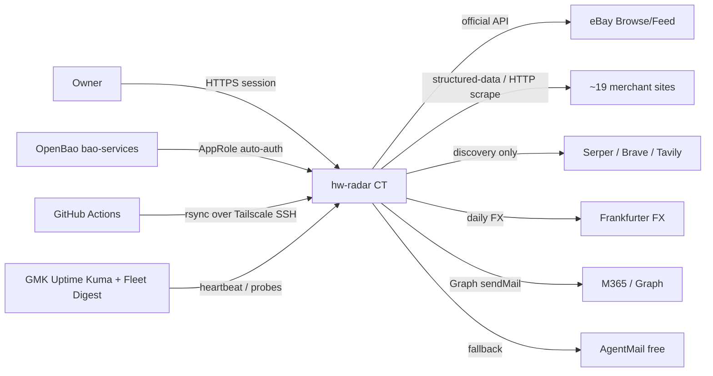
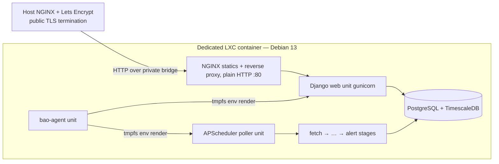
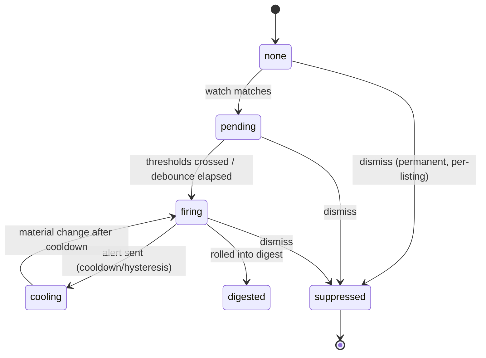

# Hardware Radar (hw-radar) — Specification (Full)

---

## Revision History

| Version | Date | Author | Change |
| --- | --- | --- | --- |
| 0.1 | 2026-07-04 | Claude (consolidation, owner-directed) | Initial consolidation of the original spec (`docs/archived/hw-radar.md`), ADRs 0001–0017, and the resolved/open question record into SPEC-0000. |
| 0.2 | 2026-07-04 | Claude (owner-ratified) | Consolidation-call ratification (TODO §Claude items 1–2): filled frontmatter `owner`/`implementer`; demoted FR-009 to **Should**; split FR-010 (snooze-granularity carved out to new **FR-013**/Should; the permanent-dismiss + state-tracking guarantee stays **FR-010**/Must, so G-002's low-noise trace keeps a Must backing); stripped the 29 inline heading tailoring tags (profile→section map retained in Appendix D); corrected the over-broad `provisional` marker on the search-settings rows (row architecture is ADR-0016-ratified — only values are provisional). **Separately** (ADR-0018 landed in the same working copy just before this consolidation-call, with no version bump of its own): reconciled the manufacturer-spec-catalog into the body — new "Manufacturer spec catalog" glossary term, IR-007, DR-009, D-018, §9 downstream-groups reference/seed promotion, and References ADR range → 0001–0018. Status deliberately remains `draft`. |
| 0.3 | 2026-07-04 | Claude (owner-approved design) | Listing→catalog matching layer designed ([ADR 0019](../adr/adr-0019-listing-catalog-matching-layer.md), **proposed** — ratification gated on the C.3.5 labeled-corpus validation): Appendix C.3 hardened (four extraction layers incl. quantity/lot + WD↔SanDisk brand normalization, five-rung conservative ladder, grain-elastic attach + agreement-set inheritance, append-only `listing_resolution`, grain-addressed aliases with OEM PNs capped at family/model, view-based backfill queue, precision contract); added D-019, DR-010; updated the §8.2 entity-resolver row and the §9 downstream-groups note. Backed by two new research reports (SSD part-number decoding + bootstrap datasets; OEM part-number cross-referencing). |
| 0.4 | 2026-07-04 | Claude (owner-directed hygiene audit) | Spec-hygiene audit fix pass (41 verified findings across spec/ADRs/questions): eBay heartbeat-retention carve-out in DR-008; WD/Seagate fast-lane text reconciled to the completed recon spike; ADR-0019 added to frontmatter/References; §8.1 narrative gains D-015 gating + D-018/D-019 resolution; R-011 false-merge risk; §19 MS-1–MS-2 catalog/matcher tasks + ADR-0019 ratification gate; §18.5 unresolved-listing alert; milestone-ID convention aligned to M# (reverted in v0.5); glossary + workflow + polish fixes. |
| 0.5 | 2026-07-04 | Claude (owner-approved conformance pass) | Template-contract conformance (the source template set was refactored 2026-07-04 into tiered Light/Standard/Full files with a machine contract — `check_specs.py` + tooling notes): milestone IDs reverted repo-wide to the contract's `MS-#` form (spec, ADRs, questions record — supersedes v0.4's `M#` unification, which predated the published contract); Appendix A milestone row restored to the `MS-` prefix form the contract's parser requires; H1 gains the `(Full)` profile suffix; the reference-catalog refresh heading under §10.1 un-numbered (its ad-hoc `10.1b` number is outside the canonical section registry). |
| 0.6 | 2026-07-04 | Claude (owner-directed) | Pinned the CT resource sizing — the last open provisioning input (§18.1 gains a "CT resources" row): v1 starting allocation **2 vCPU · 4 GiB · 32 GiB rootfs · 512 MiB swap**, derived from the HTTP-first single-user workload (in-CT PostgreSQL+TimescaleDB is the RAM/disk driver; browser deferred, ADR 0014), with an MS-5 bump to ≥4 vCPU · 8 GiB and disk growth guarded by the §18.5 disk-space alert. Tunable/hot-resizable; no ADR (an operational parameter, not an architecture decision). The infrastructure architecture is now fully finalized for provisioning. |
| 0.7 | 2026-07-04 | Claude (owner-directed cleanup) | Pre-planning doc-hygiene pass (no design change): corrected the revision-history ordering (v0.6 had been inserted above v0.5). Repo-level companion changes in the same pass: **`AGENTS.md` re-tracked** (removed from `.gitignore` — it had been briefly un-tracked 2026-07-04, which 404'd the public README link + its spec citations; now valid again), the `dependency-review` CI actions bumped, and further-research prompt #14 + the SSD report frontmatter id corrected. |
| 0.8 | 2026-07-05 | Claude (owner-directed) | MS-0 doc close-out against the **live CT-116 deployment** (no design change): §17.3 traceability rows for the provisioning-gated MS-0 slices (NFR-003, IR-001, IR-005) flipped **Pending provisioning → Verified (MS-0 live)** with the acceptance evidence, and the table lead-in updated to reflect acceptance; §13.6 CSRF/CORS hardening item checked off (CSRF: Django default + `CSRF_TRUSTED_ORIGINS` from `HW_RADAR_ALLOWED_HOSTS`; CORS: N/A, same-origin app). |
| 0.9 | 2026-07-05 | Claude (owner-directed hygiene sweep) | Pre-MS-1 drift cleanup (no design change): reconciled the TLS-termination topology to the deployed **Model A** — public HTTPS terminates at the container *host's* reverse proxy (host NGINX + Let's Encrypt), the in-CT NGINX runs plain HTTP `:80` and proxies to gunicorn, and Django trusts `X-Forwarded-Proto`. Updated §8.1, the §8.2.2 deployment diagram, and the §18.1 runtime-services table (all had shown TLS terminating inside the CT). |
| 0.10 | 2026-07-05 | Claude (owner-ratified MS-1 brainstorm) | MS-1 design brainstorm outcome (decomposition + one new dependency; no architecture change): **OQ21 resolved** — `httpx` approved for API-tier/FX/heartbeat HTTP paths (§8.6 row added; §21 OQ-021 row; scrape-tier fetching stays Scrapy per D-014). MS-1 decomposition + owner scope ratifications (heartbeat gating in MS-1d for the 3 confirmed fast-lane sources; full C.2+ADR-0017 substrate in MS-1a; corpus-labeling workflow; 5 sub-plans with PR-per-sub-milestone) recorded in [`docs/superpowers/specs/2026-07-05-ms1-ingestion-design.md`](../superpowers/specs/2026-07-05-ms1-ingestion-design.md). Also fixed the v0.8/v0.9 revision-row ordering (v0.9 had been inserted above v0.8). |
| 0.11 | 2026-07-05 | Claude (Codex spec-audit reconciliation) | Fast-lane starting-set drift fix (no rule change — FR-002's intersection stands): C.2's "Starting fast-lane set" (and the same sentence in ADR-0015, corrected in the same pass) had listed **ServerPartDeals + confirmed-Shopify specialists**, contradicting FR-002's `drop-prone ∩ cheap-signal` rule and the [volatility research](../research/2026-07-04-per-source-inventory-volatility-and-fast-lane-polling.md) (`churning`, "Fast-lane: No"). Corrected set: eBay recert stores + WD/Seagate direct; Shopify-class sources stay heartbeat-decoupled at tier cadence. Surfaced by the MS-1 design Codex audit (SA-002, round 2). |

**Spec lifecycle:** This document is **living until `approved`**, then **change-controlled**: post-approval edits require a new revision row and, for scope-affecting changes, re-approval by the owner. Implementation deviations are recorded in the [Deviations Log](#deviations-log), not silently patched into requirements. When replaced, set `status: superseded` and `superseded_by:` in the frontmatter.

> **Consolidation notes (owner-directed, 2026-07-04):**
>
> 1. This spec **reflects existing repo state only** — it consolidates the original spec, the ADRs (the authoritative decision record), and the open/resolved-question record. It resolves nothing new.
> 2. The **full template skeleton is retained** regardless of profile, by explicit owner direction (overriding the template's profile-pruning instruction) — this spec is expected to grow. Sections with no supporting repo content keep their template guidance wrapped in `<placeholder-guidance>` tags; that text is **not spec content**.
> 3. Items settled in [`resolved-questions.md`](../resolved-questions.md) **without** an ADR are marked **_provisional_** throughout: they are the current working position, not locked decisions. ADRs are the authoritative record for decisions.

---

## 1. Purpose & Background

Hardware Radar is a search-and-monitoring tool that watches ~20 online marketplaces — manufacturer recertified stores, storage-specialist resellers, major retailers/marketplaces (eBay, Amazon, Newegg), business VARs, and refurbished-server sellers — for hard disk drives (HDDs) and solid-state drives (SSDs). It scores each listing (0–100) on price, availability, seller reputation, and fitness-for-purpose to surface the best deals for a homelab/small-business buyer who favors **enterprise/NAS-grade** and **recertified** drives, and it alerts on availability and price drops.

- **Who has the problem:** the single owner/maintainer, buying drives for L3Digital assets. The tool is built for personal/business use and optimized for the owner's convenience; the first version deliberately does not spend effort on multi-user friendliness or cross-compatibility.
- **The outcome:** the owner can see, in one place, the current best drive deals across the monitored merchants, understand _why_ each deal scored what it did, and get a low-noise email when a watch-worthy deal appears or a price drops.
- **First-release scope:** drives (HDD/SSD) only; single account; the six-milestone MVP plan in §19. Extensibility to more users, marketplaces, scoring criteria, alert channels, and hardware types (RAM, GPUs) must remain possible without a rewrite (the **Extensibility & Expandability** principle in §1's General Design Principles, structurally satisfied by [ADR 0010](../adr/adr-0010-canonical-data-model.md)).
- **Compounding value:** the **accumulating price-history database is the tool's moat** — repeated price observations over time enable the cohort-relative scoring ([ADR 0011](../adr/adr-0011-composite-deal-score.md)) and historical trend analysis, and are the primary reason backup coverage is load-bearing ([ADR 0003](../adr/adr-0003-deploy-as-lxc-container.md)).

**General Design Principles** (carried verbatim in intent from the original spec — they bound every decision below):

- **Engineered to Needs** — meet the owner's specific needs; do not over-engineer until proven necessary.
- **Extensibility & Expandability** — easy future expansion to additional users/accounts/preferences, marketplaces, scoring criteria, alerting mechanisms, and hardware types (RAM, GPUs, …).
- **Maintainability** — clean, well-documented code following best practices.
- **Reliability** — robust, graceful error handling; keeps functioning when marketplace APIs or networks misbehave.
- **Security** — sensitive information (API keys, credentials) handled securely; never committed, hard-coded, or exposed.
- **Moderate Aggressive Usage** — avoid excessive requests or scraping that could be considered abusive, violate terms of service, or result in rate limiting.

---

## 2. Scope

### 2.1 In Scope

- Per-source **freshness-SLO** monitoring of ~20 online marketplaces for HDD and SSD listings — polling cadence governed by each source's _volatility profile_ (drop-prone / churning / stable), not a uniform "real-time" scan (FR-001/FR-002; full marketplace list: Appendix C.1).
- Tiered acquisition: official APIs → machine-readable structured data → HTTP scrape, escalating browser-last ([ADR 0014](../adr/adr-0014-scraping-runtime-escalation-stack.md)); search APIs for discovery only.
- Canonical-entity normalization and cross-marketplace entity resolution ([ADR 0010](../adr/adr-0010-canonical-data-model.md)).
- Currency/landed-cost normalization to USD ([ADR 0008](../adr/adr-0008-currency-landed-cost-normalization.md)).
- Explainable 0–100 composite deal scoring ([ADR 0011](../adr/adr-0011-composite-deal-score.md)).
- A database of current and past listings with price-history time series ([ADR 0007](../adr/adr-0007-datastore-postgresql-timescaledb.md)), sortable/filterable by user preferences (brand, capacity, interface type, …).
- Email alerts on availability and price drops, with dedup/debounce ([ADR 0013](../adr/adr-0013-notification-transport-m365-graph.md)).
- A single-account, web-based UI (dashboard, listing detail, watches, price history) ([ADR 0004](../adr/adr-0004-web-framework-django-htmx.md), [ADR 0005](../adr/adr-0005-single-account-session-auth.md)).
- Historical data analysis: price trends and availability patterns over time.

### 2.2 Out of Scope (Non-Goals — never)

| ID | Non-Goal | Reason |
| --- | --- | --- |
| NG-001 | Payment processing or facilitating transactions between buyers and sellers. | The tool only collects, stores, and presents information and alerts (original spec, Out of Scope). |
| NG-002 | Logging in to merchant sites, or **first-party** anti-bot bypass / CAPTCHA solving, to scrape. | Legal/ToS posture: public logged-out pages only; this guardrail bounds the Moderate Aggressive Usage principle (original spec, Special Considerations). Sole recorded carve-out: [ADR 0014](../adr/adr-0014-scraping-runtime-escalation-stack.md)'s Tier-4 **outsourced managed-unblocker** for a tiny high-value tail (a few URLs) — otherwise the source is SKIPped; routine solving stays the hard stop. |
| NG-003 | LLM-driven "browser agents" for scraping. | Playwright use is code-driven, deterministic, headless automation only ([ADR 0014](../adr/adr-0014-scraping-runtime-escalation-stack.md)). |

### 2.3 Won't Have in v1 (deferred — not never)

| ID | Deferred Capability | Why Deferred | Revisit When |
| --- | --- | --- | --- |
| WH-001 | Multi-user auth (Authelia forward-auth, MFA) | Premature for a single user; adds an identity provider with no current need ([ADR 0005](../adr/adr-0005-single-account-session-auth.md)) | Additional users actually needed (the `users` table is stubbed now so this is additive) |
| WH-002 | SMS / push notification channels | Email covers v1; SMS/push named as potential future channels (original spec) | Owner demand |
| WH-003 | Additional hardware types (RAM, GPUs, …) | v1 is drives only; the identity spine is category-generic so this is a new satellite + rows, not a rewrite ([ADR 0010](../adr/adr-0010-canonical-data-model.md)) | Post-v1, if the tool proves useful |
| WH-004 | Paid transactional email provider (Postmark primary / SES fallback) | Owner constraint: v1 email must be free ([ADR 0013](../adr/adr-0013-notification-transport-m365-graph.md)) | Deliverability proves a problem |
| WH-005 | Purchase analytics (realized savings, spend history) | Comparable tools use "purchased" only to stop tracking; ship only a `purchased` flag + two nullable fields as scaffolding (_provisional_ — [resolved-questions.md OQ6](../resolved-questions.md#oq6--final-ui-page-inventory--dismisssuppress-feedback--purchase-tracking), no ADR) | Post-v1 |
| WH-006 | Error tracking (GlitchTip / Sentry) | Not in the existing homelab stack; add only if wanted (resolved gap #6) | Operator demand |
| WH-007 | Secondary analytics warehouse (ClickHouse) / search index (OpenSearch) | Scale-out path only; PostgreSQL+TimescaleDB is the source of truth ([ADR 0007](../adr/adr-0007-datastore-postgresql-timescaledb.md)) | Analytics or search UX demands it |
| WH-008 | Accessibility (WCAG) & i18n targets | Single sighted user, English-only — Engineered to Needs ([OQ19 resolved](../resolved-questions.md#oq19--accessibility--i18n-declaration), owner-declared 2026-07-04); server-rendered semantic-ish HTML keeps a retrofit additive | Additional or differently-abled users appear |

### 2.4 Boundaries

| Boundary | Description |
| --- | --- |
| System owns | The listings/price-history database (canonical entities, listings, observations, scores, watches, alert state), the scoring math and its explanation payloads, the acquisition scheduler and per-source governance state, the web UI, and outbound alert emails. |
| System depends on | The ~20 monitored marketplaces (pages + official APIs, esp. eBay Browse/Feed); search APIs (Serper/Brave/Tavily) for discovery; Frankfurter for FX; the OpenBao `bao-services` store + local `bao-agent` for runtime secrets; Microsoft Graph → M365 for email; NGINX + Let's Encrypt; the Hetzner Proxmox host and its restic/dump backup + fleet-digest monitoring pipelines; the off-site GMK Uptime Kuma heartbeat; Tailscale (admin/CD path); GitHub Actions (CI/CD). |
| System does not own | Marketplace data policies/ToS; the homelab backup and monitoring scripts (private `homelab` repo — hw-radar must be _wired into_ them at provisioning); the M365 tenant; the tailnet ACL; DNS/certificates beyond its own vhost. |

---

## 3. Context

### 3.1 Current State

The repo is **scaffolded but feature-less**: the Python toolchain (uv · Ruff · BasedPyright strict · pytest + coverage · pip-audit) is live and green (`AGENTS.md`, [ADR 0002](../adr/adr-0002-python-tooling-standard-local-deviations.md)), CI runs the gate, and `src/hw_radar/` is a version-only skeleton. All design substance lives in this spec, the ADRs ([`docs/adr/`](../adr/)), the research corpus ([`docs/research/`](../research/)), and the question record ([`open-questions.md`](../open-questions.md) / [`resolved-questions.md`](../resolved-questions.md)). No server is provisioned yet; the target infrastructure (Hetzner CT fleet, backup/monitoring pipelines, `bao-services` secrets store) exists and was live-verified 2026-07-03/04. There is no existing implementation being replaced — the "current state" for the _problem_ is manual deal-hunting across merchant sites.

### 3.2 Target State

A dedicated LXC container on the Hetzner Proxmox host runs the Django web app, the APScheduler poller, its own PostgreSQL+TimescaleDB, and a local OpenBao Agent; merge to `main` deploys automatically; the owner uses `https://hw-radar.l3digital.net` to browse scored deals and manage watches, and receives deduplicated alert emails via the M365 Graph path; the CT is wired into the existing backup and monitoring pipelines plus an off-box heartbeat.

### 3.3 Assumptions

| ID | Assumption | Impact if False |
| --- | --- | --- |
| A-001 | The web app holds **no secrets or sensitive data** (secrets resolve at runtime via the local OpenBao Agent and never live in the app). | The single-account auth model ([ADR 0005](../adr/adr-0005-single-account-session-auth.md)) loses its load-bearing rationale and must be revisited — this constraint "must remain true for this decision to stay valid." |
| A-002 | The M365 tenant (already paid for and operated) remains available for Graph `sendMail`. | Alerting fails over to the AgentMail free fallback; a total/durable loss reopens the transport decision ([ADR 0013](../adr/adr-0013-notification-transport-m365-graph.md)). |
| A-003 | The Hetzner CT infrastructure behaves as characterized 2026-07-03 (file-level restic + hourly logical dumps, allowlist-based; fleet-digest auto-discovers CTs from `pct list`) — resolved-questions.md RQ4. | Backup/monitoring reuse assumptions break; the CT-vs-VM trade ([ADR 0003](../adr/adr-0003-deploy-as-lxc-container.md)) would need re-evaluation. |
| A-004 | The tailnet ACL currently allows the ephemeral `tag:ci` runner to reach the CT (grants are wildcard as of 2026-07-04). | When the wildcard→scoped ACL migration lands without an explicit `tag:ci → hw-radar CT:22` grant, **the deploy silently breaks** (resolved-questions.md OQ2 / [ADR 0006](../adr/adr-0006-cd-rsync-over-tailscale-ssh.md)). |
| A-005 | Most target sources keep exposing needed fields via structured data (JSON-LD, platform JSON, bootstrap JSON) on plain HTTP. | Sources escalate up the tier ladder (`curl_cffi` → Playwright → managed unblocker → skip) per [ADR 0014](../adr/adr-0014-scraping-runtime-escalation-stack.md) and the OQ9 skip policy. |
| A-006 | 2026 drive prices reflect an abnormal, supply-constrained run-up (~46%); any seeded `$/TB` baseline is market-dated. | Seeded baselines mislead; they must be timestamped and aged out as real observations accrue (resolved gap #12). |

### 3.4 Constraints

| ID | Constraint | Source |
| --- | --- | --- |
| C-001 | The repository is **public**: no secrets, internal hostnames/IPs, or infrastructure addresses in files or commits; OpenBao _paths_ are acceptable as references. Live infra specifics stay in the private `homelab` repo. | Repo convention; ADR 0003/0009 disclosure boundary |
| C-002 | OpenBao is the org credential store; production resolves secrets at runtime; a local `.env` is for development only. | Org standard; [ADR 0009](../adr/adr-0009-secrets-runtime-openbao-agent.md) |
| C-003 | Every service deploys in a dedicated LXC container (VM-direct requires a recorded exception). | Homelab standard; [ADR 0003](../adr/adr-0003-deploy-as-lxc-container.md) |
| C-004 | v1 email transport must be **free** (no paid email service for now). | Owner (resolved-questions.md OQ13) |
| C-005 | The deploy host blocks outbound ports 25/465 — self-hosted SMTP is out. | Hetzner ([ADR 0013](../adr/adr-0013-notification-transport-m365-graph.md)) |
| C-006 | The Python Tooling SSOT Standard governs all code: uv, Ruff, BasedPyright strict, pytest + coverage, pip-audit; the verification gate must pass. | `AGENTS.md`; [ADR 0002](../adr/adr-0002-python-tooling-standard-local-deviations.md) |
| C-007 | Scraping guardrails: public logged-out pages only; never log in / first-party anti-bot bypass / CAPTCHA solving (sole carve-out: the Tier-4 managed-unblocker tail per [ADR 0014](../adr/adr-0014-scraping-runtime-escalation-stack.md) / NG-002); `ROBOTSTXT_OBEY=True`; AUTOTHROTTLE + honor `429`/`Retry-After`; honest User-Agent; prefer official APIs; store facts not expression; no PII; stop on a specific cease-and-desist. | Original spec, Special Considerations (legal posture, re-verified 2026-07-03) |
| C-008 | Search-API spend: owner comfort band **$10–20/month total** for the three providers combined. | Owner (resolved-questions.md OQ7/gap #10) |
| C-009 | The public-repo CI/CD workflow holds **no OpenBao credential** — it ships code and restarts services only. | [ADR 0006](../adr/adr-0006-cd-rsync-over-tailscale-ssh.md) / [ADR 0009](../adr/adr-0009-secrets-runtime-openbao-agent.md) |
| C-010 | Admin access to the deploy target is Tailscale-only; no public SSH port. | [ADR 0006](../adr/adr-0006-cd-rsync-over-tailscale-ssh.md) |

---

## 4. Goals

| ID | Goal | Success Signal | Achieved By |
| --- | --- | --- | --- |
| G-001 | Surface the best HDD/SSD deals across the monitored marketplaces with a quantitative, explainable score. | Owner can rank/filter deals by score and inspect _why_ each listing scored what it did. | FR-001–FR-006, FR-009 |
| G-002 | Alert the owner on availability and price drops with low noise. | A matching drop fires exactly one actionable email (gap #8 / MS-4 acceptance). | FR-007, FR-010, FR-013 |
| G-003 | Accumulate a durable price-history dataset (the compounding moat) enabling trend analysis and cohort-relative scoring. | Repeated runs produce time-series observations under stable canonical entities; history survives failures (backups restore-tested). | FR-003, FR-006, DR-002, DR-005, §18.6 |
| G-004 | Operate with minimal marginal cost and ops burden by reusing existing homelab infrastructure. | Zero-cost email path; search spend inside the owner's band; CT auto-monitored; backups ride the existing pipeline. | C-004, C-008, D-003, D-013, §18 |

---

## 5. Stakeholders and Users

Single-stakeholder project: the owner/maintainer is simultaneously the end user, operator, developer (with coding-agent implementers bound by Appendix B), and approver. The original spec's Audience section records that v1 is optimized for the owner's convenience only, while remaining extensible to other users later.

| Role / Stakeholder | Concern | Involvement |
| --- | --- | --- |
| Owner (single maintainer) | Deal quality, alert signal/noise, cost ceilings, legal posture | Uses system; makes all ratification decisions; approves release |
| Coding agent (implementer) | Unambiguous requirements, verification gate, deviation protocol | Builds the system under Appendix B |

---

## 6. Glossary

| Term | Definition | Notes / Not to be confused with |
| --- | --- | --- |
| `product_model` | The **physical**, condition-free canonical drive entity (identity anchor: manufacturer + normalized model number, surrogate id). | Not a retail page; not condition-specific ("recert 14 TB Exos" and "new 14 TB Exos" are one model). [ADR 0010](../adr/adr-0010-canonical-data-model.md) |
| `product_variant` | The **sellable** identity: condition · packaging · recert-channel · warranty-channel. The unit of price comparison; price analytics roll up here. | Distinct from `product_model` (physical) and `listing` (one merchant's page). |
| `listing` | One merchant's offer page for a variant; carries a derived `listing_fingerprint`. | A listing is a _representation_ of a product, never the canonical product itself. |
| `offer_snapshot` | A time-series observation of price/stock/FX/score for a listing — the TimescaleDB hypertable. | Repeated price checks are observations, not new listings. |
| `availability_heartbeat_observation` | A cheap, no-render poll result (raw fingerprint, stock/price fields, endpoint + cache metadata, decision `unchanged`/`transition_detected`/`ambiguous`/`failed`) that gates the full pipeline — a full `offer_snapshot` is produced only on a detected transition. _([ADR 0015](../adr/adr-0015-availability-heartbeat-grain-volatility-scheduling.md); [polling-cadence reconciliation](../research/2026-07-04-polling-cadence-reconciliation.md))_ | A new grain **above** `offer_snapshot`, not a replacement; keyed at the variant/SKU grain. |
| `drive_unit` | A physical individual drive (serial + SMART/FARM data); orthogonal grain below the model. **v1 populates it only opportunistically** from seller-posted SMART text/screenshots — no reliable acquisition source, a deliberate deferral. | Recert-trust evidence, not catalog identity. |
| `listing_resolution` | The **append-only** entity-resolution edge recording each listing→catalog match outcome (grain, target, method, confidence, `matcher_version`, evidence) — never overwritten; re-resolution appends and supersedes. _([ADR 0019](../adr/adr-0019-listing-catalog-matching-layer.md); DR-010)_ | An identity edge, not a listing observation; the DR-004 explanation posture applied to identity. |
| Manufacturer spec catalog | The authoritative **reference-data** layer seeded from manufacturer first-party specs (datasheets/structured data), populating `product_model`/`drive_spec`/`product_alias` on its own slow cadence, append-only. | A distinct source class, not a listing source; enriches resolution, never gates it ([ADR 0018](../adr/adr-0018-manufacturer-spec-catalog.md)). |
| `retention_class` | Per-record legal-persistability class governing storage/TTL (`merchant_fact`, `ebay_listing_observation`, `amazon_ephemeral`/`amazon_identifier`, `transient_discovery`, `tavily_extract`). | Encoded in the schema, not convention. |
| Cohort | The peer group for price scoring: capacity · tier · interface/form-factor · condition — [ADR 0011](../adr/adr-0011-composite-deal-score.md)'s ratified four-part key for HDDs **and** SSDs. DWPD endurance folds into the _fitness_ subscore, not the cohort key ([OQ16 resolved 2026-07-04](../resolved-questions.md#oq16--ssd-cohort-key-endurance-dimension-dwpd)). | Cohort-relative percentile, not absolute `$/TB` thresholds. |
| `n_eff` | Effective sample size `(Σw)²/Σ(w²)` under the 90-day window with 30-day half-life decay; full scoring confidence at `n_eff ≥ 30`. | Below 30 the score shrinks toward neutral and is marked _provisional_. |
| Veto cap | A non-compensatory ceiling on the composite score (SMR-for-NAS → 35; used/no-returns → 60; low seller trust → 60). | A cap, not a subtractive penalty. |
| Recertified | Factory/vendor-recertified drive (a distinct condition channel and `product_variant`). | Not the same as "used" or "seller-refurbished." |
| CMR / SMR | Conventional vs Shingled Magnetic Recording; device-managed SMR is a hard suitability reject for enterprise/NAS use. | Stored as a typed `drive_spec` column (`recording_tech`). |
| Tier (acquisition, T0–T4) | Per-source polling class: T0 eBay API · T1 manufacturer-direct · T2 specialist/VAR · T3 anti-bot-exposed · T4 refurb/regional. | Distinct from marketplace _trust posture_ (Appendix C.1) and from the _extraction_ tier ladder (JSON-LD → … → HTML). |
| Volatility profile | Per-source inventory-behavior class — `drop-prone` (bursty recert restocks clearing in minutes–hours), `churning` (continuous new listings; aggregate-price value), `stable` (days-timescale) — the _second_ scheduling axis: how fast a source **needs** polling, vs the tier's how fast it **can** be polled. _([ADR 0015](../adr/adr-0015-availability-heartbeat-grain-volatility-scheduling.md); [reconciliation report](../research/2026-07-04-polling-cadence-reconciliation.md))_ | Orthogonal to the acquisition tier; fast-lane = `drop-prone` ∩ verified cheap signal. |
| Soft-block | An HTTP-200 response that is not the real page (challenge page, empty body, missing structured data) — counted as a failed fetch. | Detection rules in §12.1 / Appendix C.2. |
| `paused_pending_fix` | Circuit-breaker state for a source with sustained `parser_rot` or an `anti_bot` verdict: excluded from scheduling until fixed; daily recovery probe. | Distinct from permanent SKIP (registry state, human re-review). |
| CT | LXC container on the Proxmox host (the deployment unit — [ADR 0003](../adr/adr-0003-deploy-as-lxc-container.md)). | Not a VM. |
| Watch | A user-defined rule (hard filters + thresholds) that matches listings and drives alerting; the unit of alert opt-out. | Watch-rule UI has no free-text title matching. |
| OQ / RQ / gap | Open question (undecided) / resolved question / original spec-audit finding — the repo's decision-tracking IDs ([`open-questions.md`](../open-questions.md)). | §21 uses template-style `OQ-` ids mapped to these. |

---

## 7. Requirements

> **Provenance note:** the original spec expressed requirements as a Features list plus milestone acceptance criteria (resolved gap #8); the sources do not assign formal requirement IDs or Must/Should priorities. The IDs below are assigned by this consolidation for traceability; priorities were **owner-ratified in v0.2** (see Revision History) — FR-009→Should, FR-010 split into FR-010/Must + FR-013/Should — with all remaining IDs confirmed at their milestone-derived Must default (MS-0–MS-5 all gate v1).

### 7.1 Functional Requirements

| ID | Requirement | Rationale | Acceptance Criteria | Priority |
| --- | --- | --- | --- | --- |
| FR-001 | The system shall monitor the ranked marketplaces (Appendix C.1) for HDD and SSD listings via the tiered acquisition ladder (official API → structured data → HTTP scrape, browser-last), meeting a **per-source freshness SLO** (max age of the freshest observation, measured transition-to-alert) set by the source's _volatility profile_ — not a uniform "real-time" cadence: drop-prone+cheap-signal p95 ≤ 3 min · drop-prone/no-signal p95 ≤ 15 min · churning p95 ≤ 15–30 min · stable p95 ≤ 4–6 h. _([ADR 0015](../adr/adr-0015-availability-heartbeat-grain-volatility-scheduling.md); [polling-cadence reconciliation](../research/2026-07-04-polling-cadence-reconciliation.md); supersedes the original "continuous/near-real-time" framing)_ | Core purpose. True "real-time" is unavailable from these sources (no third-party push feeds exist) and unnecessary below the human buyer's decision loop (~60–90 s); freshness is bounded per source by inventory volatility × cheap-signal affordance. | MS-1: all 5 primary recert sources yield ≥1 normalized listing on a scheduled run; MS-5: ≥15 sources live, each with an assigned freshness SLO. | Must |
| FR-002 | The system shall govern per-source polling by tier (T0–T4) with baseline→ceiling cadence, earned auto-ramp, adaptive back-off, soft-block detection, and a skip decision tree, and shall further constrain cadence by a per-source **volatility profile** (`drop-prone`/`churning`/`stable`) orthogonal to the tier — **effective cadence = min(tier ceiling, volatility need)** — with fast-lane membership = the intersection of `drop-prone` AND a verified cheap availability signal. _(tier cadence provisional — [resolved-questions.md OQ9](../resolved-questions.md#oq9--acquisition-cadence-throttle--skip-policy); volatility axis + heartbeat ratified by [ADR 0015](../adr/adr-0015-availability-heartbeat-grain-volatility-scheduling.md), [polling-cadence reconciliation](../research/2026-07-04-polling-cadence-reconciliation.md))_ | Encodes "aggressive but self-moderating" within guardrails C-007; the volatility axis stops the system polling fast where inventory doesn't warrant it. | Cadence, jitter, and 429/503 cooldown observable in `scraper_runs`; a soft-blocked source backs off to the 24 h cap; a non-`drop-prone` source is never fast-laned. | Must |
| FR-003 | The system shall normalize every acquired listing to the canonical identity ladder (`category → product_family → product_model → product_variant → listing → offer_snapshot`), resolving cross-marketplace identity via aliases + parsed attributes. | The hard problem is sameness across merchants while keeping condition/variants distinct ([ADR 0010](../adr/adr-0010-canonical-data-model.md)). | MS-1: a recert and a new listing of the same drive resolve to one `product_model`, two `product_variant`s (catalog seed + match-ladder rungs 0–2, §19); a re-run produces new `offer_snapshot` rows, not duplicate listings; MS-2: ≥80% of primary-recert-source listings at model grain or better (coverage expectation, C.3.5). | Must |
| FR-004 | The system shall normalize all prices to USD via a daily Frankfurter rate, stamp `fx_rate`/`fx_pair`/`fx_rate_date`/`fx_source` on each observation, fold known domestic shipping (+ tax where known) into `$/TB`, and flag (not haircut) international listings. | Cross-border listings must not be scored on a false basis; historical scores must be reproducible ([ADR 0008](../adr/adr-0008-currency-landed-cost-normalization.md)). | MS-1: 100% of non-USD listings carry a stored FX rate + date and a normalized USD price; international listings flagged; missing shipping is a penalty/flag. | Must |
| FR-005 | The system shall score each listing 0–100 as a weighted geometric mean of four normalized subscores (price 0.50 · fitness 0.25 · seller 0.15 · availability 0.10), gated by the three non-compensatory veto caps, with warm-up shrinkage `λ = min(1, n_eff/30)` and cohort-relaxation fallback. | Self-adjusting, explainable, hard-to-game ranking ([ADR 0011](../adr/adr-0011-composite-deal-score.md)). | MS-2: every listing has a reproducible 0–100 score; thin cohorts (`n_eff < 30`) visibly shrink toward neutral and are marked provisional; documented cohort relaxation fires on small cohorts. | Must |
| FR-006 | The system shall persist every listing's per-subscore explanation payload (percentile + margin, seller evidence, fitness pieces, cap reason) — the glass-box "why it matched" view. | Scores must stay explainable and owner-inspectable. | MS-2/MS-3: listing detail renders the per-factor breakdown and pass-margin explanations. | Must |
| FR-007 | The system shall send email alerts on watch matches and price drops with dedup/debounce: listing + alert fingerprints, cooldown/hysteresis, HMAC-signed one-click action links, and delivery confirmation, via the M365 Graph path with AgentMail free as fallback. | Alerts are the product's payload and must not spam or double-fire ([ADR 0013](../adr/adr-0013-notification-transport-m365-graph.md); gap #7). | MS-4: one qualifying drop fires exactly one email; a repost under a new URL is de-duplicated; signed snooze/stop links verify; delivery failure detectably surfaced. | Must |
| FR-008 | The system shall provide a session-authenticated web UI: Dashboard, Listing detail (score breakdown + "why it matched"), Watches manager (hard filters vs thresholds, no free-text title matching), Price-history view, and listing-state controls, with the Django admin as internal back-office. _(page inventory provisional — [resolved-questions.md OQ6](../resolved-questions.md#oq6--final-ui-page-inventory--dismisssuppress-feedback--purchase-tracking), no ADR)_ | Owner's working surface (gap #7; [ADR 0004](../adr/adr-0004-web-framework-django-htmx.md)). | MS-3: owner can filter the dashboard by brand/capacity/tier/interface/condition and create/edit/delete a watch; state changes persist. | Must |
| FR-009 | The system shall support sorting, filtering, and historical analysis of listings and price trends over time. | Informed purchasing decisions (original spec, Features). | Price-history view renders per-variant trend data from stored observations. | Should |
| FR-010 | The system shall track post-alert state per watch × listing (`none / pending / firing / cooling / digested`) and treat dismiss as a permanent per-listing suppression (a terminal `watch_match_state` enum value). _(provisional — resolved-questions.md OQ6, no ADR)_ | Low-noise alerting; "done with this" is binary and permanent in every comparable tool. | Dismissed listings never re-alert. | Must |
| FR-011 | The system shall govern its own outbound search-API calls with the ordered `SearchBudgetGate`: kill switch → persisted spend-cap circuit-breaker (reserve-then-call) → failing-provider breaker → per-provider token bucket, with per-provider user settings. _(architecture ratified by [ADR 0016](../adr/adr-0016-search-api-self-governance.md); starting rate/spend values provisional — [resolved-questions.md OQ7](../resolved-questions.md#oq7--running-cost-budget-model-build-time-pricing-pass))_ | Runaway-bug cost guard; provider dashboard caps are alert-only. | A provider whose daily cap is exhausted fails safe (`budget_exhausted`) before the call is made. | Must |
| FR-012 | The system shall record a `purchased` status flag (+ optional nullable price/date fields) on listings, as scaffolding only. _(provisional — resolved-questions.md OQ6, no ADR)_ | Stop tracking purchased items; analytics deferred (WH-005). | Marking purchased stops tracking/alerting for that listing. | Could |
| FR-013 | The system shall support snooze at watch and listing granularity, with snoozes expiring on schedule. _(provisional — resolved-questions.md OQ6, no ADR; split from FR-010 in the 2026-07-04 ratification pass)_ | Snooze granularity is a low-noise convenience refinement, not a core alerting guarantee — separable in priority from FR-010's permanent-dismiss guarantee. | A listing snooze suppresses only that listing, a watch snooze the whole watch; both expire on schedule. | Should |

### 7.2 Non-Functional Requirements

| ID | Category | Requirement | Measurement / Acceptance Criteria | Priority |
| --- | --- | --- | --- | --- |
| NFR-001 | Reliability | Acquisition shall be per-source isolated with retry/back-off and automatic circuit-breaking of failing or anti-bot-protected sources (`paused_pending_fix`), plus operator health alerts — one marketplace failing degrades gracefully without stopping the others. _([ADR 0017](../adr/adr-0017-resilient-acquisition.md); [resolved-questions.md OQ10](../resolved-questions.md#oq10--reliability--resilient-acquisition))_ | A deliberately failed source moves to `paused_pending_fix` while other sources keep polling (MS-5). | Must |
| NFR-002 | Compliance/politeness | All scraped (non-API) acquisition shall operate within the C-007 guardrails (robots.txt, throttling, honest UA, no bypass, facts-not-expression, per-source retention class). | Guardrails encoded in the scraper configuration; retention classes non-null on every evidence table. | Must |
| NFR-003 | Security | Secrets shall never be committed, hard-coded, or exposed; production resolves them from OpenBao at runtime via the local Agent (tmpfs render, no plaintext at rest); CI holds no OpenBao credential. | MS-0: service reads ≥1 secret sourced from OpenBao with no plaintext `.env` on the CT; the `bao-agent` unit survives restart. | Must |
| NFR-004 | Observability | Every scheduled/background run shall write a `scraper_runs` record (status, counts, failure class); the app shall emit a dead-man's-switch heartbeat and email-delivery confirmation; silent degradation (count vs rolling average, tier downgrade, empty results) shall be detected and alerted. _(heartbeat target provisional — [resolved-questions.md OQ5](../resolved-questions.md#oq5--off-box-heartbeat), no ADR)_ | MS-5: a deliberately broken parser trips a scraper-rot alert within one scheduled cycle. | Must |
| NFR-005 | Maintainability | All code shall pass the verification gate (`uv run python -m scripts.check`: format, lint, strict types, tests + coverage, audit) locally and in CI. | Gate exit 0 on every merge (`AGENTS.md`). | Must |
| NFR-006 | Extensibility | Adding a marketplace, scoring criterion, user, or hardware type shall not require a schema-spine or architecture rewrite (rows/satellite/plugin only). | New-category test: a `*_spec` satellite + rows suffices ([ADR 0010](../adr/adr-0010-canonical-data-model.md)). | Must |
| NFR-007 | Reproducibility | Historical scores shall be reproducible from stored inputs (FX stamps, explanation payloads, algorithm/config versions). | Re-deriving a past `$/TB`/score uses the rate and inputs actually applied (ADR 0008/0011). | Must |

### 7.3 Interface Requirements

| ID | Interface | Requirement | Contract / Format | Acceptance Criteria |
| --- | --- | --- | --- | --- |
| IR-001 | Web UI (HTTPS) | The system shall serve the UI at `https://hw-radar.l3digital.net` behind NGINX with Let's Encrypt TLS, session-authenticated. | Server-rendered Django templates + HTMX | Authenticated pages reachable over HTTPS only (MS-0/MS-3). |
| IR-002 | eBay Browse/Feed API | The system shall acquire eBay listings via the official Browse/Feed APIs (not scraping), honoring ≤6 h freshness, delete-on-delist, and PII-delete obligations. | eBay Browse API (REST); not a Restricted API | eBay rows carry `retention_class = ebay_listing_observation` and expire per policy. |
| IR-003 | Microsoft Graph | The system shall send alert email via Graph `sendMail` from the branded `@l3digital.net` sender; AgentMail (`@agentmail.to`) is the independent fallback. | MS Graph REST; creds at OpenBao `secret/apps/microsoft365` | MS-4 send path works; fallback exercisable on demand ([ADR 0013](../adr/adr-0013-notification-transport-m365-graph.md)). |
| IR-004 | Frankfurter FX | The system shall fetch USD conversion rates once per day from Frankfurter (ECB-anchored, keyless, MIT, self-hostable). | HTTP JSON API | FX stamps present on every non-USD observation ([ADR 0008](../adr/adr-0008-currency-landed-cost-normalization.md)). |
| IR-005 | Secrets file | App services shall consume secrets from the tmpfs env file rendered by the local OpenBao Agent (root-owned, `0640`, app-group-readable; gone on reboot), depending on the agent unit via `After=`. | ADR 0009 convention: `/run/bao-agent/hw-radar.env` (the original spec's `/run/hw-radar/secrets.env` is a superseded path — reconciliation follow-up recorded in ADR 0009) | MS-0: no plaintext `.env` at rest; services read the rendered file. |
| IR-006 | Search APIs | The system shall use Serper / Brave / Tavily for **discovery only** (never authoritative state); Serper/Brave results are `transient_discovery` (TTL 0 — persist only the discovered URL, then re-fetch from the merchant); Tavily-extracted facts are persistable. **Amazon rides this row** — it has no official-API integration (OQ15): its ASIN is parsed from the discovered `/dp/<ASIN>` URL and persisted indefinitely (DR-001), with any SERP price as a low-confidence 24 h hint. | Provider REST APIs; keys at OpenBao `secret/api-keys/search/` | No provider snippets/JSON persisted; discovery-weighting toward Serper (Brave free tier ended Feb 2026 — _provisional_, OQ7). |
| IR-007 | Manufacturer spec catalog | The system shall ingest authoritative drive specs from manufacturer first-party sources (datasheet/product-manual PDF + structured data first, rendered page last) as a **reference-data source class distinct from the listing pipeline** — populating `product_model` / `drive_spec` / `product_alias` (the full family→model→variant MPN matrix), on its own slow (monthly-order) cadence, append-only. It **enriches** entity resolution, never gates the observation stream: an unmatched listing is ingested and flagged for catalog backfill. | First-party datasheets/JSON-LD/product-finder JSON; reference ingest runs `fetch → parse → normalize → persist` only (no score/alert/`offer_snapshot`) | Reference rows carry `retention_class = manufacturer_reference` (DR-009); a family lands with its per-MPN variants; matched listings inherit authoritative `drive_spec` ([ADR 0018](../adr/adr-0018-manufacturer-spec-catalog.md)). |

### 7.4 Data Requirements

| ID | Data Entity | Requirement | Validation Rules | Ownership |
| --- | --- | --- | --- | --- |
| DR-001 | Evidence/observation records | Every evidence record shall carry a non-null `retention_class` + `expires_at`; persistence is governed per source (merchant facts indefinite; eBay ≤6 h freshness/delete-on-delist; Amazon = ASIN indefinite, all else ephemeral 24 h; search-provider results TTL 0). | Non-null constraint; TTL enforcement | hw-radar ([ADR 0010](../adr/adr-0010-canonical-data-model.md) rule 6) |
| DR-002 | `offer_snapshot` | FX fields (`fx_rate`, `fx_pair`, `fx_rate_date`, `fx_source`) shall be stamped on each observation, not just the current listing. | Present on every non-USD observation | hw-radar ([ADR 0008](../adr/adr-0008-currency-landed-cost-normalization.md)) |
| DR-003 | All tables | No image bytes shall be stored anywhere — image URLs/hashes only; provider result IDs are transient and never keys. | Schema review: no bytea/image columns | hw-radar (retention posture) |
| DR-004 | `listing_score` / explanation payload | Every automated score shall persist its input facts, algorithm version, thresholds/margins, confidence (`n_eff`/`λ`), risk flags, and machine- and user-facing explanations. | Payload present per scored listing | hw-radar ([ADR 0011](../adr/adr-0011-composite-deal-score.md)) |
| DR-005 | Price history | Repeated price checks shall append time-series observations to the `offer_snapshot` hypertable under stable canonical entities — never overwrite or duplicate listings. | Re-run ⇒ new observations, not new listings (MS-1) | hw-radar ([ADR 0007](../adr/adr-0007-datastore-postgresql-timescaledb.md)/[0010](../adr/adr-0010-canonical-data-model.md)) |
| DR-006 | PII | The system shall store no PII from scraped pages; cassettes/fixtures are PII-scrubbed before commit. | vcrpy filters; synthetic-only fixtures for named commercial sources _(provisional — OQ8)_ | hw-radar |
| DR-007 | Backups | The database shall be included in the host dump pipeline at provisioning, with **TimescaleDB-aware** dump/restore (or in-CT physical backup) — a plain `pg_dump` allowlist entry restores incorrectly. RPO acceptance is **resolved** — ≤1 h accepted for v1 with TimescaleDB-aware logical dumps ([OQ3](../resolved-questions.md#oq3--db-rpo-acceptance--timescaledb-dump-handling), owner-ratified 2026-07-04). | Restore test into a scratch instance (MS-5) | hw-radar + homelab pipeline ([ADR 0003](../adr/adr-0003-deploy-as-lxc-container.md)/[0007](../adr/adr-0007-datastore-postgresql-timescaledb.md)) |
| DR-008 | `availability_heartbeat_observation` | Fast-lane sources may be polled via a cheap no-render heartbeat that fires the full pipeline only on a detected transition (OOS↔in-stock, material price drop, new variant/listing ID, or post-in-stock ambiguity); the heartbeat fingerprint shall include price + stock + shipping state and be keyed at the variant/SKU grain. **Retention (owner-ratified 2026-07-04; values tunable):** raw heartbeats in a TimescaleDB hypertable (compressed ≈7 d) retained **30 days** (`retention_class = availability_heartbeat`); per-source **daily decision-class counts** in a continuous aggregate retained **indefinitely** (feeds the p95-SLO trend); non-`unchanged` rows (`transition_detected`/`ambiguous`/`failed`) **dual-written at ingest** to a plain `availability_heartbeat_event` table retained **365 days** (`retention_class = availability_heartbeat_event`; feeds fingerprint tuning — class-differentiated retention is not expressible chunk-granularly within one hypertable). **eBay carve-out:** eBay-sourced heartbeat rows carry `retention_class = ebay_listing_observation` and obey the ≤6 h freshness / delete-on-delist obligation (IR-002 / DR-001), which **caps the 30 d / 365 d TTLs above for that source**. _([ADR 0015](../adr/adr-0015-availability-heartbeat-grain-volatility-scheduling.md); [polling-cadence reconciliation](../research/2026-07-04-polling-cadence-reconciliation.md); [OQ17 resolved](../resolved-questions.md#oq17--heartbeat-grain-retention--storage-policy), [retention research](../research/2026-07-04-availability-heartbeat-retention-and-storage-policy.md))_ | Grain **above** `offer_snapshot`; variant-keyed; transition-gated | hw-radar (extends [ADR 0010](../adr/adr-0010-canonical-data-model.md) via [ADR 0015](../adr/adr-0015-availability-heartbeat-grain-volatility-scheduling.md)) |
| DR-009 | Manufacturer spec catalog | Reference-catalog rows (`product_model` / `drive_spec` / `product_alias` seeded from manufacturer first-party specs) shall carry `retention_class = manufacturer_reference` — **indefinite and append-only**: a model discontinued upstream is **retained, not pruned** (discontinued drives dominate the recert market). Catalog ingest writes no `offer_snapshot`/score/alert. | New `retention_class`; discontinued-model rows survive a later refresh; full family→model→variant MPN matrix persisted as aliases | hw-radar (extends [ADR 0010](../adr/adr-0010-canonical-data-model.md) rule 6 via [ADR 0018](../adr/adr-0018-manufacturer-spec-catalog.md)) |
| DR-010 | `listing_resolution` | Every entity-resolution outcome shall persist as an **append-only** edge row — grain, target, method, confidence, `matcher_version`, evidence payload — never overwritten; re-resolution (catalog refresh, matcher-version bump, alias revocation) appends and supersedes. Denormalized current-resolution FKs on `listing` are most-specific-wins with lower grains NULL. `product_alias` rows are grain-addressed and carry `source_kind` (`catalog_authoritative` / `listing_derived` / `manual`); learned aliases are revocable, and revocation cascades a re-run of the listings they resolved. | Append-only enforcement; the DR-004 explanation posture applied to identity; OEM-PN aliases capped at family/model grain | hw-radar (extends [ADR 0010](../adr/adr-0010-canonical-data-model.md) via [ADR 0019](../adr/adr-0019-listing-catalog-matching-layer.md), Appendix C.3.3) |

---

## 8. Architecture and Design

### 8.1 Architecture Summary

Hardware Radar is a **single-container, single-database, single-maintainer** system. One dedicated LXC container on the Hetzner Proxmox host (D-003) runs everything: a Django web application with server-rendered templates + HTMX (D-004), a long-running APScheduler poller process (D-012), a PostgreSQL + TimescaleDB instance (D-007) holding both the relational catalog and the price-history hypertable, and a local OpenBao Agent that renders runtime secrets to tmpfs (D-009). Public HTTPS is terminated one hop up, at the container **host's** reverse proxy (host NGINX + Let's Encrypt), which proxies over the private bridge to the container's own NGINX on plain HTTP; the in-container NGINX serves static files and proxies to gunicorn, and Django trusts the forwarded-proto header (**Model A** — the NAT'd container has no public IP to answer ACME directly; see §18.1).

The data path is a staged pipeline — **`fetch → parse → normalize → entity-resolve → score → persist → alert`** — with stages independently testable and re-runnable. For fast-lane sources (`drop-prone` ∩ verified cheap signal) this pipeline is gated behind a cheap no-render `availability_heartbeat_observation` that fires the full pipeline only on a detected transition (D-015 / [ADR 0015](../adr/adr-0015-availability-heartbeat-grain-volatility-scheduling.md)). Acquisition is **tiered by source**: official APIs first (eBay Browse/Feed), then machine-readable structured data (JSON-LD → platform JSON → bootstrap JSON → HTML selectors), then HTTP-first scraping escalating browser-last (`curl_cffi` → Playwright via `scrapy-playwright` → managed unblocker or skip) (D-014); search APIs are discovery-only. The poller owns all shared acquisition state in-process: per-source cadence/jitter, two-level token buckets, back-off ladders, and the circuit-breaker registry — the reason scheduling is one supervised process rather than per-scrape systemd timers (D-012).

Identity is the system's hardest problem and is fixed by the multi-grain ladder (D-010): the canonical entity is the condition-free physical `product_model`; sellable condition/packaging variants, per-merchant listings, and time-series observations hang below it; external identifiers are alias rows; drive attributes live in a typed `drive_spec` satellite so the spine stays category-generic. Resolution against that ladder is an authoritative lookup — listings are matched to a manufacturer-seeded spec catalog (D-018) through a grain-elastic matching layer whose outcomes persist as append-only `listing_resolution` edges with grain-addressed aliases (D-019, proposed), not fuzzy listing-to-listing matching. Prices are normalized to USD with per-observation FX stamps (D-008), and each listing gets an explainable 0–100 composite score with veto caps (D-011).

Trust boundaries: the app is internet-facing behind a single-account session login (D-005) and is designed to hold **no in-app secrets** — the OpenBao Agent, not the app or CI, is the only credential holder (D-009); CD runs from a GitHub-hosted runner that joins the tailnet ephemerally and carries no OpenBao credential (D-006). Alert email leaves via the existing M365 Graph path (D-013).

### 8.2 Architecture Views

#### 8.2.1 Context View



#### 8.2.2 Container / Deployment View



Public TLS terminates at the **host** reverse proxy (outside the container), not inside the CT — the container is NAT'd with no public IP, so it cannot answer an ACME HTTP-01 challenge directly (**Model A**, §18.1). The in-CT NGINX runs plain HTTP on `:80`.

#### 8.2.3 Component View

| Component | Responsibility | Interfaces | Notes |
| --- | --- | --- | --- |
| Web app (Django + HTMX) | UI pages (§11), auth, watches CRUD, admin back-office | HTTP (NGINX-proxied), Django ORM | Single-account session auth; localhost-bind rule reserved for the future forward-auth path (ADR 0005) |
| Poller (APScheduler 3.11.x, `AsyncIOScheduler`) | Per-source scheduling, jitter, token-bucket admission, circuit-breaker registry, pipeline execution | systemd service; PostgreSQL checkpoints; `scraper_runs` | `max_instances=1`, `coalesce=True`, per-source `misfire_grace_time`, fetch-stage timeouts (ADR 0012) |
| Acquisition adapters (Scrapy + tier ladder) | Per-source fetch/parse via structured-data detector; escalation `curl_cffi`/Playwright (MS-5) | HTTP(S), official APIs | Guardrails C-007; failure classification §12.1 |
| Entity resolver | Map parsed listings onto the identity ladder: four-layer extraction + five-rung conservative ladder, grain-elastic attach, append-only `listing_resolution` state | DB | Appendix C.3 / [ADR 0019](../adr/adr-0019-listing-catalog-matching-layer.md); GTIN/ePID largely unavailable — seeded catalog (ADR 0018) + learned aliases are the mitigation (ADR 0018/0019) |
| Scoring engine | Composite deal score + explanation payloads | DB | Appendix C.4; ADR 0011 |
| Alerting layer | Watch matching, post-alert state machine, dedup/debounce, digests, signed action links, send via Graph | Graph API, DB | Transport-agnostic logic; ADR 0013 fixes only the send mechanism |
| bao-agent | AppRole auto-auth against `bao-services`; render secrets to tmpfs | OpenBao API, tmpfs file | Persistent CIDR-bound SecretID; ADR 0009 |
| SearchBudgetGate | Ordered admission for outbound search calls (kill switch → spend cap → breaker → bucket) | DB (persisted counters) | [ADR 0016](../adr/adr-0016-search-api-self-governance.md) (values provisional — OQ7) |

### 8.3 Design Decisions

The ADRs are the authoritative record; each row is a pointer, not a restatement.

| ID | Decision | Rationale | Alternatives Considered | ADR |
| --- | --- | --- | --- | --- |
| D-001 | Decline the Markdown Frontmatter Standard; ADR-only frontmatter as an unvalidated local convention. | Solo, low-churn repo doesn't recoup fleet-CI enforcement cost; keeps the high-value supersession metadata. | Full adoption; no frontmatter anywhere | [ADR 0001](../adr/adr-0001-decline-markdown-frontmatter-standard.md) |
| D-002 | Adopt the Python Tooling SSOT Standard with local deviations (`.vscode/`/`CLAUDE.md` stay git-ignored; the deferred-gate deviation was retired at scaffold). | Public-repo hygiene; toolchain fixed before code lands. | Conform fully; defer adoption | [ADR 0002](../adr/adr-0002-python-tooling-standard-local-deviations.md) |
| D-003 | Deploy as a dedicated LXC container, not a VM; DB on container Postgres. | Reuses the CT-shaped backup/monitoring infra; honors the dedicated-LXC standard; trade-off: no vTPM. | Standalone VM | [ADR 0003](../adr/adr-0003-deploy-as-lxc-container.md) |
| D-004 | Django + server-rendered templates + HTMX; Django admin as internal back-office. | The app is an authenticated listings DB + dashboards + CRUD + alerts, not an API platform. | FastAPI + Jinja; FastAPI + SPA | [ADR 0004](../adr/adr-0004-web-framework-django-htmx.md) |
| D-005 | Single-account session auth (Argon2id, hardened cookies), internet-facing; `users` table stubbed; Authelia reserved for multi-user. | Minimal surface, load-bearing on "no sensitive data in the app" (A-001). | Tailscale-only; full multi-user + MFA now | [ADR 0005](../adr/adr-0005-single-account-session-auth.md) |
| D-006 | CD from a GitHub-hosted runner: ephemeral tailnet join (`tag:ci` OAuth client), rsync + remote restart over Tailscale SSH; venv built on-CT; expand/contract migrations. | Public repo must not run a self-hosted runner; no public SSH port; CI holds no OpenBao credential. | Self-hosted runner; registry/image deploy | [ADR 0006](../adr/adr-0006-cd-rsync-over-tailscale-ssh.md) |
| D-007 | PostgreSQL as system-of-record + TimescaleDB for the observation workload. | Mixed relational + document + time-series shape in one always-on service; plain-PostgreSQL is the explicit fallback. | Plain PostgreSQL; MySQL/MariaDB; ClickHouse-primary | [ADR 0007](../adr/adr-0007-datastore-postgresql-timescaledb.md) |
| D-008 | Frankfurter FX → USD stamped per observation; fold known domestic shipping (+ tax) into `$/TB`; flag (don't estimate) cross-border cost. | Honest comparison basis; reproducible history; no stale tariff constants. | Fixed international haircut; exact landed cost; item price only | [ADR 0008](../adr/adr-0008-currency-landed-cost-normalization.md) |
| D-009 | Runtime secrets via a local OpenBao Agent on the CT (`bao-services` consumer, AppRole auto-auth, tmpfs render, persistent CIDR-bound SecretID); CD holds nothing. | No plaintext at rest, no credential in public-repo CI; reuses the live LiteLLM pattern. | CD-injected wrapped secret_id; plaintext `.env`; systemd-creds/TPM2 | [ADR 0009](../adr/adr-0009-secrets-runtime-openbao-agent.md) |
| D-010 | Canonical data model = generic multi-grain identity ladder + typed per-category satellite; identifiers as aliases; `retention_class` on every evidence record. | Identity is the costliest-to-reverse table; recert-vs-new must be first-class; extensible without a spine rewrite. | Two-level model/snapshot; generic EAV | [ADR 0010](../adr/adr-0010-canonical-data-model.md) |
| D-011 | Composite deal score = weighted geometric mean of four subscores with non-compensatory veto caps; `n_eff ≥ 30` warm-up; stored explanations. Validated against mock data pre-ratification. | Self-adjusting, explainable, hard to game; arithmetic sums are too compensatory. | Weighted arithmetic sum; TOPSIS | [ADR 0011](../adr/adr-0011-composite-deal-score.md) |
| D-012 | Orchestration = APScheduler 3.11.x in one systemd-supervised poller process owning shared admission/breaker state (amends ADR 0006's "timers for scrapes"). | Scrape jobs share fast-mutating state; 3.x can't share a job store across processes; brokers are over-engineering. | Per-scrape systemd timers; Celery/RQ/Dramatiq/Taskiq | [ADR 0012](../adr/adr-0012-orchestration-apscheduler.md) |
| D-013 | Alert email via the existing M365 Graph send path (branded, zero marginal cost); AgentMail free as independent fallback; Postmark/SES retained only as the paid-upgrade path. | Free constraint (C-004); no dependence on volatile third-party free tiers; Hetzner blocks SMTP ports. | AgentMail-primary; paid transactional; other free tiers | [ADR 0013](../adr/adr-0013-notification-transport-m365-graph.md) |
| D-014 | Scraping runtime = HTTP-first, structured-data-first, browser-last four-tier ladder (Scrapy → `curl_cffi` → `scrapy-playwright` → managed unblocker/skip); tiers 2–3 deferred to MS-5. | Most sources need no browser; the browser is a scalpel, not the default engine. | Full stack now; browser/managed-API by default | [ADR 0014](../adr/adr-0014-scraping-runtime-escalation-stack.md) |
| D-015 | Add the `availability_heartbeat_observation` grain above `offer_snapshot` + a per-source volatility profile as a second scheduling axis (effective cadence = min(tier ceiling, volatility need); fast lane = drop-prone ∩ verified cheap signal). | One snapshot per real transition keeps the price-history moat clean; polling budget flows to where inventory actually moves; freshness becomes a measurable per-source SLO. | Snapshot-per-poll with no new grain; volatility axis without the cheap grain | [ADR 0015](../adr/adr-0015-availability-heartbeat-grain-volatility-scheduling.md) |
| D-016 | Search self-governance = the ordered `SearchBudgetGate` (kill switch → persisted reserve-then-call spend cap → failing-provider breaker → token bucket) + a per-provider settings row; numeric values stay tunable (OQ7). | Provider dashboard caps are alert-only; an in-memory guard resets exactly when a runaway bug strikes; the gate order is the decision — each stage cheaper and more final than the next. | Dashboard caps + in-memory limiter; single global spend cap | [ADR 0016](../adr/adr-0016-search-api-self-governance.md) |
| D-017 | Resilient acquisition = per-source isolation + a persisted source-state lifecycle (`active ↔ backing-off → paused_pending_fix → active`, `→ SKIP`) driven by the failure-classification tree, with silent-degradation detection + health alerting. | One source failing must never halt the others; the failure class routes each source to the right remedy (retry / quarantine / human fix / alert). | Monolithic run with best-effort try/except; retry-only with no terminal states | [ADR 0017](../adr/adr-0017-resilient-acquisition.md) |
| D-018 | Manufacturer spec catalog = a first-class **reference-data** source class (datasheet/structured-data-first, own slow cadence, append-only/never-delete) that authoritatively populates `product_model` / `drive_spec` / `product_alias` (the full family→model→variant MPN matrix); it enriches entity resolution and never gates the observation stream (unmatched listing → backfill queue). | Listing-inferred specs are unauthoritative and leave the resolver no match target; the finite manufacturer set makes an authoritative catalog tractable; discontinued models (the recert core) must be retained. | Infer specs from listings only; buy a third-party spec feed as sole authority | [ADR 0018](../adr/adr-0018-manufacturer-spec-catalog.md) |
| D-019 | Listing→catalog matching layer = a rules-only four-layer extraction stack + a five-rung **conservative** match ladder (only exact/deterministic rungs auto-accept; hard-attribute contradictions force review) with **grain-elastic attachment** (listing→variant is the goal state, not an ingest invariant; coarse grains inherit only the agreement-set `drive_spec` fields), resolution state as an **append-only `listing_resolution` edge**, grain-addressed aliases (OEM part numbers → family/model only — the OEM↔MPN relationship is many-to-many), a view-based backfill queue with an occurrence-triggered discovery loop, and a labeled-corpus precision gate (≥ 99.5% auto-accept) before ratification. | False merges poison the price-history moat asymmetrically (a miss just queues); "family known, exact MPN unknown" is the common recert case; part-number grammars are only partially decodable with uneven authority; no bulk OEM→MPN source exists. | In-place resolution columns; off-the-shelf probabilistic ER framework (Splink/dedupe); LLM/NER-first extraction | [ADR 0019](../adr/adr-0019-listing-catalog-matching-layer.md) (proposed — ratification gated on the C.3.5 validation corpus) |

### 8.4 Solution Alternatives Considered

<placeholder-guidance>
Solution-level alternatives (buy vs. build, existing tool X, prior architecture Y) — distinct from the per-decision alternatives above. One row each prevents relitigating.

| Alternative                           | Why Rejected                   |
| ------------------------------------- | ------------------------------ |
| `<existing tool / SaaS / do-nothing>` | `<gap, cost, risk, licensing>` |

_No repo source records a formal buy-vs-build evaluation. Existing tools (Keepa, diskprices.com, CamelCamelCamel, PCPartPicker) appear in the research only as cold-start seed/reference sources, not as evaluated alternatives to building._ </placeholder-guidance>

### 8.5 Design Constraints

Constraints the implementer must not violate:

- The scraping guardrails (C-007) are encoded in the scraper, not left as convention: `ROBOTSTXT_OBEY=True`, AUTOTHROTTLE, honor `429`/`Retry-After`, honest User-Agent, public logged-out pages only, no first-party anti-bot/CAPTCHA bypass (Tier-4 managed-unblocker carve-out per NG-002/[ADR 0014](../adr/adr-0014-scraping-runtime-escalation-stack.md)), store facts not expression, no PII, stop on a specific cease-and-desist.
- No image-byte storage anywhere (URLs/hashes only); provider result IDs are transient, never keys (DR-003).
- The identity spine (`category → product_family → product_model → product_variant → listing → offer_snapshot`) is category-generic; only `drive_spec` is drive-shaped. Do not "simplify" back to the two-level model/snapshot shape ([ADR 0010](../adr/adr-0010-canonical-data-model.md) explicitly supersedes it).
- Retention/PII/licensing are enforced **in the schema** (`retention_class`/`expires_at`), not by convention.
- No plaintext secret at rest on the CT; no OpenBao credential in CI; deploy only on `push`/`workflow_dispatch` to `main` (never `pull_request`/`pull_request_target`); deploy job behind a GitHub Environment with a required reviewer ([ADR 0006](../adr/adr-0006-cd-rsync-over-tailscale-ssh.md)/[0009](../adr/adr-0009-secrets-runtime-openbao-agent.md)).
- Migrations are expand/contract (backward-compatible with still-running old code) and run before restart.
- Search APIs are discovery-only — never authoritative state, never re-polling sources that have free official feeds.
- Watch-rule UI: hard filters separate from thresholds; no free-text title matching (gap #7).
- Do not build or act on a derived **eBay price model** (retention research §8 gray area — counsel-flagged); storing current-offer observations per the Browse API terms is the permitted posture.

### 8.6 Dependency Policy

| Dependency | Allowed? | Reason |
| --- | --- | --- |
| Django (+ `contrib.auth`, admin), HTMX | Yes | Framework decision (D-004) |
| PostgreSQL + TimescaleDB extension | Yes | Datastore decision (D-007); plain PostgreSQL is the documented fallback |
| Scrapy | Yes | Acquisition orchestrator (D-014) |
| APScheduler **3.11.x** | Yes | Scheduler (D-012). **4.x is prohibited until it drops its production warning** — re-evaluate then |
| `curl_cffi`, `scrapy-playwright`/Playwright | Conditional (MS-5) | Deferred tiers — add only when a specific source demands them (D-014) |
| vcrpy, syrupy, Pydantic v2 | Yes | Scraper test/validation stack (gap #9; _build-time params provisional_, OQ8) |
| httpx | Yes | HTTP client for API-tier calls (eBay Browse OAuth/REST), Frankfurter FX fetches, and ADR-0015 heartbeat probes — paths where Scrapy is the wrong tool; scrape-tier fetching stays Scrapy (D-014). Owner-approved 2026-07-05 ([OQ21](../resolved-questions.md#oq21--httpx-dependency-for-apifxheartbeat-http-paths)) |
| uv (env/deps), Ruff, BasedPyright, pytest+coverage, pip-audit | Yes | Toolchain standard (D-002; `AGENTS.md`) |
| Argon2 password hashing | Yes | Auth decision (D-005) |
| Frankfurter | Yes | FX source (D-008) — keyless, MIT, self-hostable |
| Redis (and Celery/RQ/Dramatiq/Taskiq/Repid) | No | Rejected as over-engineered distributed-broker solutions; Redis adds CVE surface (D-012) |
| Managed scraping/unblocker APIs | Conditional | Reserved for a tiny high-value hostile tail — or skip the source (D-014, OQ9 skip policy) |
| Error-tracking SaaS/self-hosted (Sentry/GlitchTip) | Conditional | Not in the existing stack; add only if wanted (WH-006) |

> Agents: introducing a dependency not listed here requires an OQ- entry and owner approval — see Appendix B.

---

## 9. Data Model

The canonical data model is **fixed by [ADR 0010](../adr/adr-0010-canonical-data-model.md)** (the topology and grain rules); exhaustive column lists are deliberately delegated to the research ([`database-architecture.md`](../research/database-architecture.md) for the base schema, generated columns, and indexing; the [suitability taxonomy](../research/machine-usable-drive-suitability-taxonomy-for-24-7-nas-and-server-scoring.md) for the `drive_spec` field tables) so they can evolve without a new ADR. Concrete DDL/migrations land at MS-0/MS-1.

**The identity ladder:**

| Grain | Table | What it is | Key rule |
| --- | --- | --- | --- |
| Category | `category` | `drive` (v1); later `ram`, `gpu` | The extensibility axis |
| Family | `product_family` | e.g. "Exos X18", "IronWolf Pro" | Watches and tier-lookup target this |
| **Model** | `product_model` | the **physical** variant, **condition-free** | Canonical identity anchor (`manufacturer + normalized_model_number`, surrogate id) |
| **Variant** | `product_variant` | the **sellable** identity: condition · packaging · recert-channel · warranty-channel | Price analytics roll up here |
| Listing | `listing` | one merchant's offer page | Carries a derived `listing_fingerprint` |
| Observation | `offer_snapshot` | time-series price/stock/FX/score | The TimescaleDB hypertable |
| **Heartbeat** (gating) | `availability_heartbeat_observation` | a cheap no-render poll result: price+stock+shipping fingerprint + decision (`unchanged`/`transition_detected`/`ambiguous`/`failed`) | Grain **above** `offer_snapshot`, keyed at the variant/SKU grain; a full snapshot fires only on a detected transition ([ADR 0015](../adr/adr-0015-availability-heartbeat-grain-volatility-scheduling.md)) |
| **Unit** (orthogonal) | `drive_unit` | a physical drive: serial + SMART/FARM | Grain below the model; recert-trust evidence. **v1 populates it only opportunistically** from seller-posted SMART text/screenshots — no reliable acquisition source, a deliberate deferral |

Supporting tables: `product_alias` (external identifiers — GTIN/UPC, ASIN, ePID, OEM/retail/region part numbers as many-to-one alias rows, never canonical columns), `drive_spec` (typed 1:1 satellite: scoring-critical typed columns such as `recording_tech`, `plp`, `market_tier`, `model_family`, `dwpd`, `workload_tb_year`; long tail in `spec_json`), `manufacturer`, `seller`, `source_site`, `raw_payload`, `search_observation`, `verification_event` (warranty-lookup cache).

**Engine features in play** (ADR 0007): `jsonb` for raw provider payloads; **stored generated columns** for row-local economics (`dollars_per_tb`, `total_landed_price`, normalized capacity/warranty); `pg_trgm` for fuzzy matching during entity resolution; expression/partial/GIN/BRIN indexes for hot subsets; materialized views / continuous aggregates for cross-row rankings ("lowest price in 30 days").

**Retention & provenance:** every evidence/observation record carries `retention_class` + `expires_at` (DR-001); FX stamps live per observation (DR-002); no image bytes anywhere (DR-003); score explanation payloads are persisted (DR-004).

**Downstream table groups** (attach to this spine; specified in their own research, to get their own ADRs or milestone implementations — ADR 0010 "deferred detail"): scoring (`cohort_baseline`, `seller_rating_observation`, `listing_score`), alerting (`watch`, `watch_selector`, `watch_match_state`, `notification_event`), scraper-ops (`source`, `scraper_runs`), reference/seed (`model_family_ref` + the manufacturer spec catalog seeding `product_model`/`drive_spec`/`product_alias` — now **fixed by [ADR 0018](../adr/adr-0018-manufacturer-spec-catalog.md)**, D-018; `hdd/ssd_price_baseline`), entity-resolution (`listing_resolution` + grain-addressed/`source_kind`-classed `product_alias` — now **fixed by [ADR 0019](../adr/adr-0019-listing-catalog-matching-layer.md)**, D-019/DR-010), plus the `users` stub (D-005) and per-provider search-governance settings rows (row architecture ADR-0016-ratified; starting _values_ provisional, OQ7).

**Retention & archival policy:** per-source `retention_class` TTLs (DR-001); backups per §18.6 (RPO ≤1 h accepted for v1 — OQ3, resolved).

---

## 10. Behavior and Workflows

### 10.1 Primary Workflow

The recurring acquisition pipeline, per source, under the poller:

```mermaid
sequenceDiagram
    participant Sched as Poller (APScheduler)
    participant Src as Source adapter
    participant Site as Marketplace
    participant DB as PostgreSQL+TimescaleDB
    participant Alert as Alerting layer

    Sched->>Src: admission check (token buckets, breaker, cadence)
    Src->>Site: fetch (API / structured data / HTTP)
    Site-->>Src: page / API response
    Src->>Src: parse → normalize (USD, FX stamp) → entity-resolve
    Src->>DB: persist listing / offer_snapshot / raw_payload (+ scraper_runs record)
    DB->>DB: score (composite + explanation payload)
    DB->>Alert: watch matching
    Alert-->>Alert: dedup / debounce / state machine
    Alert->>Site: — (none)
    Alert->>DB: notification_event
    Alert->>Alert: send email (Graph; fallback AgentMail)
```

Steps:

1. The poller admits the source (cadence due, token buckets available, breaker closed).
2. Fetch via the source's acquisition tier (official API → structured data → HTTP; browser tiers MS-5+).
3. Parse via the structured-data detector; validate records (Pydantic v2).
4. Normalize: canonical entities, USD price with FX stamp, shipping fold-in, international flag.
5. Entity-resolve onto the identity ladder (Appendix C.3).
6. Persist listing/observation rows + a `scraper_runs` record.
7. Score (Appendix C.4) against the persisted observation / moving baseline, then store the explanation payload — the canonical `score → persist` stage realized as persist-observation → score → persist-score.
8. Match watches; drive the post-alert state machine; send deduplicated email.

Expected result:

> New/changed listings land as normalized, scored rows with time-series observations; qualifying watch matches produce exactly one actionable email each.

> **Fast-lane heartbeat gating (D-015 / [ADR 0015](../adr/adr-0015-availability-heartbeat-grain-volatility-scheduling.md)):** for fast-lane sources (`drop-prone` ∩ verified cheap signal) the recurring poll is a cheap no-render `availability_heartbeat_observation`; steps 2–8 above execute only on a non-`unchanged` decision (`transition_detected`/`ambiguous`), so the `offer_snapshot` hypertable stays clean and one snapshot lands per real transition.

#### Reference-catalog refresh (manufacturer spec catalog)

The manufacturer spec catalog (IR-007 / D-018 / [ADR 0018](../adr/adr-0018-manufacturer-spec-catalog.md)) is a distinct **reference-data** source class with its own **truncated** pipeline — `fetch → parse → normalize → persist` only, writing `product_model` / `drive_spec` / `product_alias` and stopping there (no `score`/`alert`, no `offer_snapshot`/heartbeat rows). The poller schedules it as its own **slow (monthly-order) job off the fast path**; reference rows carry `retention_class = manufacturer_reference` (DR-009). It **enriches** entity resolution and never gates the observation stream — an unmatched listing is still ingested and flagged for catalog backfill (Appendix C.3.4).

### 10.2 Alternate Workflows

| ID | Trigger | Behavior | Expected Result |
| --- | --- | --- | --- |
| AW-001 | Timeout on fetch | One in-run retry with full jitter ≤10 s _(provisional — OQ9)_ | Transient failures self-heal without back-off escalation |
| AW-002 | `429` with `Retry-After` | Honor the header verbatim (clamped 1 s..baseline) | Provider-directed pacing respected |
| AW-003 | `429`/`503` without header, or soft-block detected | Back-off `random(0,1) × min(24 h, 10 min × 2^failures)`; cadence resets to baseline | Escalating cooldown capped at 24 h |
| AW-004 | N=4 consecutive clean polls (no error/soft-block, latency < 2× rolling median) | Auto-ramp: halve the interval, floored at the tier ceiling _(provisional — OQ9)_ | Earned faster polling on healthy sources |
| AW-005 | Latency spike (>3× median across 3 polls) | Halve cadence (slow down, don't stop) | Load-shedding without losing the source |
| AW-006 | Sustained `parser_rot` or `anti_bot` classification | Circuit-break to `paused_pending_fix`; daily recovery probe; operator alert _([ADR 0017](../adr/adr-0017-resilient-acquisition.md))_ | One source's failure never halts the others |
| AW-007 | Cooldown repeatedly maxes at 24 h on soft-block after exhausting the ladder (short of first-party CAPTCHA/stealth rungs) | Permanent SKIP (registry state, human re-review) — or the deliberate [ADR 0014](../adr/adr-0014-scraping-runtime-escalation-stack.md) Tier-4 managed-unblocker exception for a tiny high-value tail; legal/ToS triggers force SKIP regardless | Hostile sources exit the rotation deliberately |
| AW-008 | Search-provider budget exhausted / kill switch on | `SearchBudgetGate` fails safe before the call (`budget_exhausted`) _([ADR 0016](../adr/adr-0016-search-api-self-governance.md))_ | No runaway spend |
| AW-009 | Graph send failure | Surface delivery failure detectably; AgentMail fallback exercisable on demand | Alerts don't silently vanish |

### 10.3 Edge Cases

| ID | Edge Case | Expected Behavior |
| --- | --- | --- |
| EC-001 | VAT-inclusive UK/EU shelf price | Must **not** be treated as the export price (VAT should be zero-rated on export) — ingestion handles this ([ADR 0008](../adr/adr-0008-currency-landed-cost-normalization.md)) |
| EC-002 | Shipping unknown | Penalty or flag — never silently scored as if free |
| EC-003 | Cross-border listing | USD-normalized, flagged ("international — extra shipping/duty likely; verify before buying"); no fixed haircut, no computed duty |
| EC-004 | Listing reposted under a new URL | De-duplicated via listing fingerprint (MS-4 acceptance) |
| EC-005 | Thin cohort (`n_eff < 30`) | Score shrinks toward neutral 0.5, marked _provisional_; documented cohort relaxation (condition → adjacent capacity → parent tier) |
| EC-006 | Seller with no ratings | Conservative policy prior (0.60 major marketplace / 0.50 otherwise) as an explicit missing-data state |
| EC-007 | HTTP 200 but wrong page (challenge/empty/stale) | Soft-block detection (structured-data absence · body-size outlier <20% of median · challenge markers · repeated identical hash despite confirmed movement) reclassifies the fetch as failed |
| EC-008 | SSD compared on capacity alone | Never — SSDs cohort on the full four-part key (capacity · tier · interface/form · condition, [ADR 0011](../adr/adr-0011-composite-deal-score.md)); an endurance mismatch is priced by DWPD in the _fitness_ subscore rather than by partitioning the cohort ([OQ16 resolved](../resolved-questions.md#oq16--ssd-cohort-key-endurance-dimension-dwpd)) |
| EC-009 | Source returns 0/malformed records N runs in a row | Count-vs-rolling-average assertion triggers an alert (runtime validation, gap #9) |

### 10.4 State Transitions

**Post-alert state machine (per watch × listing)** — _provisional_ (gap #7 / OQ6, no ADR):



| State | Meaning | Entry Condition | Exit Condition |
| --- | --- | --- | --- |
| `none` | No active match | Default | Watch matches |
| `pending` | Matched, not yet alert-worthy | Watch match | Thresholds crossed or match lapses |
| `firing` | Alert sent/active | Threshold + debounce | Cooldown starts / digest |
| `cooling` | Post-alert hysteresis | Alert sent | Material change or expiry |
| `digested` | Included in a digest | Digest assembly | — |
| `suppressed` (dismiss) | Permanent per-listing opt-out — a **terminal** value on the existing `watch_match_state.current_state` enum (no TTL, no new table) | User dismisses | Terminal |

Stateful-automation contract (gap #7): dedup on **listing + alert fingerprints**; snooze at two granularities (watch `snoozed_until`; listing 24 h / 7 d); one-click actions as HMAC-signed single-purpose links; the **watch is the unit of opt-out**; delivery status tracked (`notification_event`).

**Source lifecycle** ([ADR 0017](../adr/adr-0017-resilient-acquisition.md); skip-ladder cutoff per OQ9): `active ↔ backing-off → paused_pending_fix → active` (after fix + recovery probe) and `→ SKIP` (permanent, registry state, human re-review).

---

## 11. UI Pages / API Endpoints

Page inventory confirmed as-is 2026-07-04 — _provisional_ ([resolved-questions.md OQ6](../resolved-questions.md#oq6--final-ui-page-inventory--dismisssuppress-feedback--purchase-tracking), no ADR; validated against CamelCamelCamel, Keepa, changedetection.io, Slickdeals). Rendering: Django server-rendered templates + HTMX (D-004).

| Page or Endpoint | Purpose | Key Actions | Authorization |
| --- | --- | --- | --- |
| Dashboard | Deal overview and filtering | Filter by brand/capacity/tier/interface/condition; sort by score | Session (single account) |
| Listing detail | Inspect one listing: score breakdown + "why it matched" (per-threshold pass-margin lines) | View facts, price history, explanation payload; state actions (dismiss/snooze/purchased) | Session |
| Watches manager | Create/edit watch rules | Hard filters vs thresholds (no free-text title matching); create, edit, delete, snooze | Session |
| Price-history view | Trend analysis per variant | Inspect time-series observations | Session |
| Listing-state controls | Post-alert actions | Dismiss (permanent suppress), snooze (24 h / 7 d), mark purchased | Session; HMAC-signed one-click links from email |
| Django admin | Internal back-office: offer inspection, entity-match correction, ingestion triage | Standard admin CRUD | Session (superuser) |

**Accessibility & i18n:** **out of scope for v1** (owner-declared 2026-07-04, [OQ19 resolved](../resolved-questions.md#oq19--accessibility--i18n-declaration)) — the UI serves a single sighted user, English-only, consistent with the Engineered-to-Needs principle. No WCAG target, no string externalization (WH-008). Server-rendered Django templates + HTMX (D-004) keep the markup close to semantic HTML, so a later retrofit is additive rather than structural.

---

## 12. Error Handling and Recovery

### 12.1 Expected Failures

The failure-classification tree (evaluated in order) — _provisional_ ([resolved-questions.md OQ8](../resolved-questions.md#oq8--scraper-testing-finalization), no ADR): `transient` → `anti_bot` → `parser_rot` → `degradation` → `UNKNOWN` (escalate).

| ID | Failure Mode | User/System Behavior | Logging / Observability | Recovery |
| --- | --- | --- | --- | --- |
| ERR-001 | `transient` (timeout / 5xx / DNS / TLS / 408) | Retry per AW-001; back-off ladder on repetition | `scraper_runs` failure class | Self-heals; never circuit-breaks on a transient |
| ERR-002 | `anti_bot` (401/403/429/503, `cf-mitigated=challenge`, JSON endpoint returns `text/html`, Cloudflare/DataDome markers) | Back-off ladder; circuit-break to `paused_pending_fix` on the verdict | `scraper_runs` + operator alert | Escalate tier ladder (MS-5) or SKIP per policy |
| ERR-003 | `parser_rot` (HTTP 200 authentic page, extractor/Pydantic fails) | Source → `paused_pending_fix` | Scraper-rot alert within one scheduled cycle (MS-5 acceptance) | Code fix + daily recovery probe |
| ERR-004 | `degradation` (validates but extraction tier worsened, or field completeness drops) | First-class signal distinct from hard failure: alert when `actual_tier_rank > expected_tier_rank` ≥2 consecutive runs or ≥3 of last 5; quality alert when `required_fields_present_pct < max(0.90, rolling_30d_median − 0.20)` | Canary emits `selected_tier`/`expected_best_tier`/`required_fields_present_pct`/`record_count`/`content_type`/`body_bytes` | Investigate; parser update |
| ERR-005 | Email send failure | Detectably surfaced (delivery confirmation) | `notification_event` + operator signal | AgentMail fallback on demand |
| ERR-006 | Search budget exhausted / provider failing | Fail safe before the call; provider breaker (5 failures/10 min → open; 5-min cooldown doubling to 60-min cap; single half-open trial; accelerated trip on 429/auth-quota) _([ADR 0016](../adr/adr-0016-search-api-self-governance.md); breaker thresholds tunable — OQ7)_ | Persisted spend counters; settings-visible state | Half-open probe; manual kill-switch reset |
| ERR-007 | Poller crash | systemd `Restart=on-failure`; in-memory state checkpointed to PostgreSQL | journal + `scraper_runs` | Supervised restart recovers from checkpoints |

### 12.2 Retry and Idempotency

- **Retried:** transient fetch failures (classification `transient`); provider-directed retries (`Retry-After`).
- **Not retried (alert instead):** `anti_bot` and sustained `parser_rot` (circuit-break); configuration/legal stops (SKIP).
- **Idempotency / dedup:** re-running acquisition produces new `offer_snapshot` observations, never duplicate `listing` rows (MS-1 acceptance); alerting dedups on listing + alert fingerprints (MS-4); scheduler blast radius bounded by `max_instances=1`, `coalesce=True`, per-source `misfire_grace_time` (D-012).

Scheduled/high-volume external work uses the scheduler/circuit-breaker module — see Appendix C.2.

### 12.3 Rollback / Recovery

Deploy rollback: redeploy the previous SHA via the same rsync path — demonstrated as an MS-0 acceptance criterion; migrations are expand/contract so old code keeps running against a newer schema during the window. Data recovery: restore from the host dump/restic pipeline (§18.6) — restore must be **TimescaleDB-aware** (`timescaledb_pre_restore()`/`post_restore()`; compression state not preserved) or from physical backup; a restore test into a scratch instance is an MS-5 acceptance criterion, and the monthly restore-test discipline applies regardless. Partial-failure state (a crashed run mid-pipeline) is visible in `scraper_runs` and recovered by re-running the source's stages (stages are independently re-runnable, §8.1).

---

## 13. Security and Privacy

### 13.1 Authentication

Single strong-password account with Django `contrib.auth` session login, **Argon2id** hashing (OWASP 2026 default), `Secure` + `HttpOnly` + `SameSite=Lax` cookies; internet-facing ([ADR 0005](../adr/adr-0005-single-account-session-auth.md)). Optional TOTP addable later without schema change; a `users` table is stubbed so multi-user is additive. Future multi-user end state: Authelia forward-auth at NGINX — with its recorded security rules (bind app to localhost only; NGINX **overwrites** the trusted-identity header; pin a patched gateway release — live header-trust/`auth_request` bypasses: `CVE-2025-54576`, `CVE-2026-34457`).

### 13.2 Authorization

| Actor / Role | Allowed Actions | Denied Actions |
| --- | --- | --- |
| Owner (the single account) | All UI actions; Django admin (back-office) | — |
| Unauthenticated visitor | Login page; HMAC-verified one-click action links (single-purpose: snooze/stop) | Everything else |
| CI (GitHub Actions) | rsync code to the CT + `systemctl restart` over Tailscale SSH | Any OpenBao access (holds no credential) |

### 13.3 Secrets

Store credential **references** here (env var names, secret-manager paths) — never values.

| Secret | Storage Location | Access Pattern | Rotation / Notes |
| --- | --- | --- | --- |
| App runtime secrets (rendered set) | OpenBao `bao-services` store → tmpfs `/run/bao-agent/hw-radar.env` (root-owned, `0640`, app-group-readable) | `bao-agent` AppRole auto-auth; services depend via `After=` | ADR 0009 convention. _The original spec's `/run/hw-radar/secrets.env` + GMK-direct store are superseded; reconciliation follow-up recorded in ADR 0009._ |
| AppRole `secret_id` | Root-only on-disk file (mode 0600, **persistent**; path in the private `homelab` repo per ADR 0009) | Delivered operator→CT via the issuer script (response-wrap + `pct push`; script name/paths in the private `homelab` repo) | **CIDR-bound** is the active control (not TTL); rotation = re-run the issuer. `remove_secret_id_file_after_reading=true` is superseded (breaks restart safety). |
| AgentMail API token | OpenBao `secret/api-keys/ai/agentmail` (`AGENTMAIL_API_BEARER_TOKEN`) | Fallback email sends | Path also holds the agent inbox address |
| eBay API credentials | OpenBao `secret/api-keys/commerce/ebay` | Browse/Feed API calls | — |
| Search API keys (Serper/Brave/Tavily) | OpenBao `secret/api-keys/search/` | Discovery calls via `SearchBudgetGate` | New keys to be created for this project |
| M365 Graph credentials | OpenBao `secret/apps/microsoft365` | Graph `sendMail` | Referenced, never committed |
| Tailscale OAuth client | OpenBao `secret/infra/tailscale-oauth` | CI mints an ephemeral `tag:ci` node (`tailscale/github-action` v4) | Stored as GitHub **Environment secrets** with required reviewer |
| Local development | `.env` (git-ignored) | Development only | Never committed |

### 13.4 Sensitive Data

| Data | Classification | Storage | Transmission | Retention |
| --- | --- | --- | --- | --- |
| Scraped listing facts | public (facts, not expression) | PostgreSQL, per `retention_class` | HTTPS | Per-source TTLs (DR-001) |
| PII from scraped pages | — (not stored) | None; scrubbed from cassettes/fixtures | — | eBay PII-delete obligations honored |
| Owner credentials (password hash) | confidential | Argon2id hash in DB | HTTPS | Account lifetime |
| Runtime secrets | restricted | OpenBao; tmpfs render only | Bao agent (Hetzner-local) | No plaintext at rest |

### 13.5 Threats and Mitigations

| Threat | Impact | Mitigation |
| --- | --- | --- |
| Brute-force / credential-stuffing on the public login | Account takeover (bounded: no sensitive data in-app, A-001) | Argon2id + strong password + hardened cookies; later optional TOTP / rate-limiting (ADR 0005) |
| Fork-PR code reaching deploy infrastructure | Infra compromise via CI | GitHub-hosted runner only; deploy never on `pull_request*`; Environment secrets + required reviewer; ACL-scoped ephemeral node (ADR 0006) |
| OpenBao credential exposure via public-repo CI | Secrets-store compromise | CI holds **no** OpenBao credential by design (ADR 0009) |
| Compromise of the CT's network identity | SecretID misuse | CIDR-bound SecretID + `0600` root file permissions are the load-bearing controls (ADR 0009, accepted) |
| Identity-header trust bypass (future forward-auth path) | Auth bypass | Recorded rules: localhost bind, header overwrite, CVE-pinned gateway (ADR 0005) |
| Marketplace legal escalation (C&D) | Legal exposure | Guardrails C-007; stop on a specific cease-and-desist; facts-not-expression storage; counsel-flagged items tracked in the retention research |

### 13.6 Hardening Checklist

Confirm each item is addressed above or mark N/A with a reason:

- [x] Cookie/session settings — `Secure`, `HttpOnly`, `SameSite=Lax` (ADR 0005)
- [x] CSRF/CORS policy and allowed origins — CSRF: Django default protection plus `CSRF_TRUSTED_ORIGINS` derived from `HW_RADAR_ALLOWED_HOSTS`, `CSRF_COOKIE_SECURE`/`SameSite=Lax` in production (`settings.py`). CORS: **N/A** — same-origin server-rendered app (D-004), no cross-origin surface and no `django-cors-headers` dependency. Confirmed live at MS-0.
- [x] Webhook/API signature validation — one-click action links are HMAC-signed, single-purpose (gap #7)
- [x] Sensitive-data redaction in logs/fixtures — PII scrub of cassettes (OQ8, _provisional_); secrets never printed in CI (ADR 0006)
- [x] CI/CD secret handling — Environment secrets, required reviewer, no OpenBao credential (ADR 0006/0009)
- [x] Network exposure — NGINX reverse proxy + Let's Encrypt; no public SSH; admin over Tailscale only (C-010)
- [x] Identity-header trust rules if behind an auth proxy — recorded for the future Authelia path (ADR 0005)
- [x] Run as non-root; least privilege — dedicated non-root user, `ProtectSystem=strict`, `NoNewPrivileges` on service units (ADR 0006)

---

## 14. Capacity and Scale Assumptions

| Dimension | v1 Expectation | Growth Assumption | Design Consequence |
| --- | --- | --- | --- |
| Sources | ~20 marketplaces (5 at MS-1, ≥15 at MS-5) | More via `source_site` rows | Per-source registry + tier config; no per-source code beyond the adapter |
| Poll volume | Per-tier cadences (baseline→ceiling): T0 10 min→2 min · T1 30 min→5 min · T2 1 h→15 min · T3 2 h→30 min · T4 4 h→1 h _(provisional — OQ9)_ | Auto-ramp within tier ceilings | Single poller process suffices (D-012); token buckets bound domain load |
| Alert email | Well under 100/day, effectively one recipient | — | M365 limits (10K recipients/day) and AgentMail free caps (100/day · 3,000/mo) dwarf the workload (ADR 0013) |
| Search-API spend | ≈ $8–15/mo Serper-weighted (inside the $10–20 owner band) _(provisional — OQ7; Brave free tier ended Feb 2026)_ | Bounded by spend caps | `SearchBudgetGate` hard caps (FR-011) |
| Data volume | Not quantified in sources; observation history accrues continuously; raw payloads grow (disk-space alert flagged in gap #6) | Continuous accrual (the moat) | TimescaleDB hypertable + compression/retention (D-007); confirm disk-space threshold alert applies |
| Concurrency | Single user; `max_instances=1` per job | — | No locking/queueing design needed beyond the scheduler bounds |

---

## 15. Risks

| ID | Risk | Likelihood | Impact | Mitigation | Owner |
| --- | --- | --- | --- | --- | --- |
| R-001 | Backup wiring is allowlist-based and **never automatic** — a never-added CT is silently unprotected; a plain `pg_dump` entry restores a TimescaleDB DB incorrectly. | Med | High (the moat) | Mandatory provisioning step (ADR 0003); TimescaleDB-aware dumps or physical backup (OQ3, **resolved** — v1: TimescaleDB-aware logical dumps) | Owner |
| R-002 | Wildcard→scoped tailnet ACL migration lands without a `tag:ci → CT:22` grant → deploys silently break. | Med | Med | Recorded forward dependency (OQ2/ADR 0006); add the grant with the migration | Owner |
| R-003 | A source hardens its anti-bot posture → escalation up the tier ladder or SKIP. | Med | Low–Med per source | OQ9 back-off/skip detects it as a measured event (ADR 0014) | Implementer |
| R-004 | Third-party free-tier / pricing volatility (Brave killed its free tier 2026-02; Tavily acquired by Nebius 2026-02-10; AgentMail caps). | Med | Low–Med | M365-primary email (no free-tier dependence); Serper-weighted discovery; re-verify pricing before build (OQ7, dated facts) | Owner |
| R-005 | M365 tenant availability/policy couples alerting to an external tenant. | Low | Med | AgentMail independent fallback; paid path pre-researched (ADR 0013) | Owner |
| R-006 | APScheduler 3.x single-process model: scheduling, admission, and execution share one failure domain. | Low | Med | `max_instances=1`/`coalesce`/`misfire_grace_time`/fetch timeouts; re-evaluate at APScheduler 4.0 stability (ADR 0012, accepted) | Implementer |
| R-007 | 2026 market abnormality (~46% supply-constrained run-up) makes seeded baselines misleading. | High (now) | Low–Med | Cohort-relative scoring; seeds timestamped and aged out (gap #12) | Implementer |
| R-008 | Scoring calibration constants are v1-approximate (mildly generous middle band; flattened expensive tail). | High | Low | Accepted per test results; constants cheap to re-fit once real observations accrue (ADR 0011) | Owner |
| R-009 | Legal/ToS drift on scraping/retention (de-minimis suspension, tariff flux, provider terms — all dated 2026-07-03). | Med | Med | Dated-facts rule: re-verify before relying; counsel-flagged items listed in the retention research; SKIP on legal triggers | Owner |
| R-010 | PostgreSQL/tooling CVEs in the backup path (`pg_dump`/`pg_basebackup`/`pg_rewind`). | Med | Med | Patch discipline noted in OQ3/gap #5 | Owner |
| R-011 | Matching-layer false merges pollute the price-history moat (asymmetric: a false merge corrupts a canonical entity's time series, a miss only queues to backfill). | Med | High (the moat) | Conservative ladder auto-accepts only exact/deterministic rungs (0–2); hard-attribute contradictions force review; labeled-corpus precision gate (≥99.5% auto-accept) required before ADR 0019 ratification (Appendix C.3.5) — [ADR 0019](../adr/adr-0019-listing-catalog-matching-layer.md) (proposed) / D-019 | Implementer |

---

## 16. Compliance, Licensing, and Data Rights

- [x] Third-party API terms of service reviewed — per-source acquisition/retention verdicts (re-verified 2026-07-03) are encoded as `retention_class` (DR-001): eBay Browse ≤6 h/delete-on-delist/PII-delete (not a Restricted API — the pricing-tool consent bar does not apply, but no derived eBay price _model_, §8 gray area); Google Programmable Search prohibits non-transitory storage (discontinues 2027-01-01); Serper URL-only persistence; Brave storage rights require the sales-led plan (now Enterprise-only — get a live quote); Amazon = display/discovery only, ASIN-persistable, 24 h cache, no image bytes; SP-API seller-only, Creators API gated behind 10 qualified sales/30 days, PA-API closed to new registrations → **discovery-only via the search-API stack** ([OQ15 resolved](../resolved-questions.md#oq15--amazon-acquisition-path-after-pa-api-deprecation), [research](../research/2026-07-04-amazon-data-acquisition-after-paapi-getitems-deprecation.md)). See [`us-scraping-and-data-retention-landscape…`](../research/us-scraping-and-data-retention-landscape-for-a-retail-hdd-price-monitor.md).
- [x] Scraped/ingested data rights posture — merchant public pages scraped as **facts, not expression**; guardrails C-007; items tagged for counsel review are noted in the research report.
- [x] OSS license compatibility of dependencies — **PR-gated allowlist** via `actions/dependency-review-action@v4` ([`.github/workflows/dependency-review.yml`](../../.github/workflows/dependency-review.yml); GitHub's dependency graph resolves `uv.lock` natively with per-dependency license data) + a documented manual `licensecheck` pass whenever a dependency is added by direct-to-branch commit (the action is PR-triggered only). Copyleft exposure is structurally low: nothing is distributed, so GPL/LGPL impose no obligations on this self-hosted deploy (psycopg's LGPL-3.0 included); nothing AGPL is in the stack. **TimescaleDB Community (TSL):** the deploy relies on TSL-licensed features (columnstore compression, continuous aggregates, retention policies) — self-hosted internal use is expressly permitted; only offering the database as a hosted service (DBaaS) is prohibited. _([OQ20 resolved](../resolved-questions.md#oq20--oss-license-compliance-posture), owner-ratified 2026-07-04; [research](../research/2026-07-04-oss-license-compliance-tooling-for-a-uv-managed-public-python-project.md))_
- [x] PII/regulatory regimes — no PII stored (DR-006); eBay PII-delete obligations honored; no GDPR/HIPAA regime identified in sources.
- [x] Export/retention obligations — recorded in §7.4 (DR-001, DR-007).

---

## 17. Testing and Acceptance

### 17.1 Definition of Done

- [ ] All **Must** requirements implemented; acceptance criteria pass.
- [ ] Automated tests cover required behavior, error cases, and edge cases.
- [ ] Traceability matrix (§17.3) complete — every Must/Should requirement maps to a passing verification.
- [ ] Documentation deliverables (§18.7) produced.
- [ ] Security-sensitive behavior reviewed; hardening checklist (§13.6) resolved.
- [ ] Deviations Log reviewed and accepted by owner.
- [ ] No known blocking defects.
- [ ] The verification gate (`uv run python -m scripts.check`) passes locally and in CI (`AGENTS.md`).

### 17.2 Test Strategy

The scraper-testing strategy is settled (gap #9) with build-time parameters _provisional_ ([resolved-questions.md OQ8](../resolved-questions.md#oq8--scraper-testing-finalization), no ADR).

| Layer | Scope | Required Coverage | Required? |
| --- | --- | --- | --- |
| Unit / domain | Scoring math, normalization, entity-resolution rules, state machines | Critical branches, thresholds, edge cases (EC rows) | Yes |
| Integration / adapter (recorded) | Per-source parsers via **vcrpy cassettes** (record once, replay offline) | Deterministic, offline parse tests; `record_mode="none"` in CI | Yes |
| Snapshot / contract | **syrupy** golden-file assertions on parsed output | Diffs reviewed intentionally | Yes |
| Runtime validation | **Pydantic v2** per-record validation; `last_success_at` / consecutive-failure counters; count-vs-rolling-average assertion | Alert on 0/malformed N runs in a row | Yes |
| Production canary | Scheduled live structured-data contract check per source + known-value canary page, **per extraction tier** | Per-tier cadence: JSON-LD 24 h · platform-JSON 12 h · bootstrap-JSON 8 h · HTML 4 h (or `interval_hours = max(4, min(24, 24 / tier_risk_weight / source_business_weight))` with `tier_risk_weight = {jsonld: 1, platform_json: 2, bootstrap: 3, html: 6}`, `source_business_weight` = 1 normal / 2 high-value) _(provisional — OQ8)_ | Yes (non-CI-required) |
| Database | Migrations apply cleanly from empty (MS-0); constraints | Empty DB and upgrade path | Yes |
| End-to-end | Milestone acceptance criteria (§19) | Happy path + failure paths per milestone | Yes |
| Security | Auth, HMAC link verification, secret-handling | Critical misuse cases | Yes |
| Operations | Deploy/rollback (MS-0), backup restore (MS-5), alerting | Production-readiness checks | Yes |

**Cassette/fixture policy** _(provisional — OQ8)_: **synthetic-only cassettes for every named commercial source** (WD, Seagate, ServerPartDeals, goHardDrive, eBay, Amazon, Newegg, Google/Serper) — the public-repo commit rule fails for all (redistribution/anti-automation/PII); real cassettes stay private; PII scrubbing via vcrpy filters + `before_record_*` hooks; never commit product images. **CI = three workflows:** offline VCR-replay (PR-required) · snapshot-refresh (`workflow_dispatch`, live, non-required) · production-canary (`schedule`, live, non-required; opens/updates a GitHub issue on failure).

### 17.3 Requirement-to-Test Traceability

The implementer fills this in as completion evidence (Appendix B.3). MS-0 rows — foundation and provisioning-gated — are verified against the live CT-116 deployment (MS-0 accepted 2026-07-05: `https://hw-radar.l3digital.net` serving over HTTPS with a valid Let's Encrypt cert, secret read from the OpenBao render, `bao-agent` survives restart).

| Requirement ID | Test / Verification Method | Status      |
| -------------- | -------------------------- | ----------- |
| NFR-005 | `uv run python -m scripts.check` green locally; CI `check.yml` runs on PR plus `dev`/`main` pushes | Verified (MS-0 local) |
| NFR-003 (MS-0 slice) | MS-0 acceptance: at least one secret read from OpenBao render; no plaintext `.env` on CT; `bao-agent` survives restart | Verified (MS-0 live) |
| FR-003 (schema shape) | `tests/db/test_identity.py::test_recert_and_new_are_one_model_two_variants` | Verified (resolver lands MS-1) |
| DR-001 (as amended by DEV-002) | Schema constraints: `tests/db/test_market.py::test_retention_class_is_mandatory`, `test_indefinite_class_rejects_expiry`, `test_bounded_class_requires_expiry`; per-class TTL stamping/sweep land MS-1 | Partially verified (schema constraints) |
| DR-003 | `tests/db/test_market.py::test_no_binary_columns_anywhere` | Verified |
| DR-009 (schema prep) | `tests/db/test_identity.py::test_reference_tables_carry_retention_columns`; catalog ingest stamps `manufacturer_reference` at MS-1 | Verified (columns) |
| DR-010 (alias shape) | `tests/db/test_identity.py::test_alias_supports_variant_grain` and `test_alias_is_marketplace_local`; `listing_resolution`/revocation land MS-1 | Verified (schema) |
| IR-006 (persistence boundary) | `tests/db/test_market.py::test_search_observation_stores_no_provider_content` | Verified (schema guard) |
| DR-005 (schema shape) | `tests/db/test_market.py::test_snapshots_append_not_duplicate` | Verified (pipeline MS-1) |
| IR-001 (MS-0 slice) | Authenticated pages over HTTPS-only via NGINX + Let's Encrypt (valid LE cert; `/healthz` 200, login 200, `/` 302 auth-redirect over HTTPS) | Verified (MS-0 live) |
| IR-005 | systemd `EnvironmentFile=/run/bao-agent/hw-radar.env` plus `After=bao-agent` in `deploy/systemd/*`; live check at acceptance | Verified (MS-0 live) |
| ADR-0010 confirmation | `catalog` migrations 0001-0003 plus `tests/db/test_identity.py`, `tests/db/test_market.py::test_offer_snapshot_is_a_hypertable` | Verified |
| §17.2 Database layer | `tests/db/test_migrations.py::test_no_missing_migrations` plus pytest-django creating the test DB from empty on every run | Verified |

---

## 18. Deployment and Operations

### 18.1 Runtime Environment

| Item | Value |
| --- | --- |
| Runtime | Python (repo pins 3.14 via `.python-version`); uv-managed env (`uv sync --frozen` on the CT) |
| OS / Platform | Debian 13 in a dedicated Proxmox **LXC container** on the Hetzner dedicated server ([ADR 0003](../adr/adr-0003-deploy-as-lxc-container.md)) |
| CT resources (v1 starting allocation — tunable, hot-resizable) | **2 vCPU · 4 GiB RAM (4096 MiB) · 32 GiB rootfs · 512 MiB swap.** Sized for the v1 HTTP-first workload (in-CT PostgreSQL+TimescaleDB — the RAM/disk driver — plus gunicorn + APScheduler/Scrapy, single user; headless browser deferred, [ADR 0014](../adr/adr-0014-scraping-runtime-escalation-stack.md)). **MS-5 bump:** ≥4 vCPU · 8 GiB when `curl_cffi`/Playwright and ≥15 sources land (browser RAM is the driver). Disk growth guarded by the §18.5 disk-space threshold alert (raw payloads grow unbounded; DR-008 retention bounds heartbeats) — grow rootfs online on trigger. CT ID assigned at provisioning (`homelab` plan §6). |
| Datastore | PostgreSQL + TimescaleDB, in the same CT ([ADR 0007](../adr/adr-0007-datastore-postgresql-timescaledb.md); own-CT placement per OQ4) |
| External services | See §2.4 Boundaries (marketplaces, search APIs, Frankfurter, OpenBao, M365 Graph, Tailscale, GitHub Actions) |
| Scheduling | APScheduler 3.11.x in one systemd-supervised poller ([ADR 0012](../adr/adr-0012-orchestration-apscheduler.md)); systemd timers only for genuinely independent stateless jobs (nightly VACUUM, backup verification) |
| Hosting | Hetzner dedicated server (Proxmox); public URL `https://hw-radar.l3digital.net` |

Runtime services:

| Service | Purpose | Start Mode | Health Signal |
| --- | --- | --- | --- |
| Web unit (gunicorn; `ExecReload=kill -HUP $MAINPID`; not `Type=notify`) | Serve UI | systemd, dedicated non-root user, `ProtectSystem=strict`/`NoNewPrivileges` | Fleet-digest probes; Uptime Kuma |
| Poller unit (APScheduler) | Acquisition pipeline + governance state | systemd, `Restart=on-failure`, resource limits | `scraper_runs` records; dead-man's-switch heartbeat |
| bao-agent unit | Render runtime secrets to tmpfs | systemd (hardened); app units `After=` it | Unit `Active`; render file present; survives restart without re-issuing SecretID |
| NGINX (in-CT) | Static files + reverse proxy to gunicorn, plain HTTP `:80` | systemd | — |
| PostgreSQL (+TimescaleDB) | Datastore | systemd | Hourly dumps (once wired) |

**TLS termination (Model A).** Public HTTPS is terminated at the Proxmox **host's** front reverse proxy (host NGINX + certbot/Let's Encrypt), which proxies over the private bridge to the in-CT NGINX on plain HTTP `:80`. The container is NAT'd with no public IP, so it cannot answer an ACME HTTP-01 challenge itself — the LE cert is issued and renewed host-side. Django trusts `X-Forwarded-Proto` (`SECURE_PROXY_SSL_HEADER`) so it treats proxied requests as secure. The host proxy is a host service, external to the CT's own runtime services above.

### 18.2 Configuration

Concrete setting names are not yet fixed in the sources; the settled configuration _surfaces_ are:

| Setting | Required? | Default | Description |
| --- | --- | --- | --- |
| Per-source registry (tier, cadence baseline/ceiling, enabled, state) | Yes | Per-tier defaults (OQ9, _provisional_) | Drives the poller's admission/cadence |
| Per-provider search settings (`enabled`, `rate_per_min`, `burst`, `daily_call_cap`, `daily_spend_cap_usd`, `monthly_spend_cap_usd`, `alert_threshold_pct=80`, `kill_switch`, breaker params; optional `aggressiveness` enum) | Yes | Starting numbers per OQ7 (_provisional_) | One settings row per provider |
| Secrets (all runtime credentials) | Yes | — | Via the rendered tmpfs env file (§13.3), never in config files |

**Environment matrix:**

| Aspect | Dev | Staging | Prod |
| --- | --- | --- | --- |
| Secrets source | local `.env` (git-ignored, dev only) | — (no staging environment in sources) | OpenBao via local `bao-agent` → tmpfs |
| Deploy | local | — | rsync over Tailscale SSH on merge to `main` |

### 18.3 Deployment Flow

Per [ADR 0006](../adr/adr-0006-cd-rsync-over-tailscale-ssh.md):

1. Trigger: `push` / `workflow_dispatch` to `main` only (never `pull_request*`); deploy job behind a GitHub Environment with a required reviewer.
2. CI checks: the verification gate (fmt/lint/type/test/cov/audit) on a GitHub-hosted `ubuntu-latest` runner.
3. Runner joins the tailnet ephemerally (`tag:ci` via the Tailscale OAuth client, `tailscale/github-action` v4).
4. `rsync` the checked-out source to the CT; venv built **on the CT** (`uv sync --frozen`) to avoid arch/path skew.
5. Migrations run **before** restart, expand/contract (backward-compatible with still-running old code).
6. `systemctl restart` over `tailscale ssh`; the already-running bao-agent has secrets templated (CI holds no OpenBao credential).
7. Smoke test/health confirmation (MS-0 acceptance: zero manual steps).
8. Rollback: redeploy the previous SHA (demonstrated at MS-0).

### 18.4 Rollout Controls

- Kill switches: per-provider search `kill_switch` (_provisional_, OQ7); per-source `enabled`/SKIP registry state (OQ9).
- Canary / staged rollout: production scraper canaries per source/tier (§17.2) — deployment itself is single-instance, no cohort rollout in sources.
- Data migration reversibility: expand/contract discipline (§18.3).

### 18.5 Observability

Split concern (resolved gap #6): **infrastructure health** (up/disk/CPU/RAM) rides the existing Hetzner fleet-digest monitoring, which auto-discovers the CT from `pct list` (confirm a **disk-space threshold** alert applies — raw payloads grow); **application health** stays in-app.

- `scraper_runs` records for every scheduled run: start/finish/status/counts/failure class (shared substrate for OQ5/OQ8/OQ10).
- **Dead-man's-switch heartbeat** — alert on _absence_ of success, not just presence of failure.
- **Email-delivery confirmation** — an operator-side signal that a send actually left the box (kept regardless of provider, ADR 0013).
- **Off-box watchdog:** the off-site **GMK Uptime Kuma** watches the CT, additionally swept by the Hetzner Fleet Digest (_provisional_ — [resolved-questions.md OQ5](../resolved-questions.md#oq5--off-box-heartbeat), no ADR; healthchecks.io rejected). Land before entering production.

| Alert | Trigger | Severity | Owner / Action |
| --- | --- | --- | --- |
| Scraper-rot | Broken parser detected within one scheduled cycle (MS-5) | Warning | Owner; fix parser (`paused_pending_fix`) |
| Silent degradation | Tier downgrade / field-completeness / count-vs-average rules (ERR-004) | Warning | Owner; investigate |
| Source circuit-break | `anti_bot` verdict or sustained `parser_rot` | Warning | Owner; fix or SKIP |
| Search budget | `alert_threshold_pct` (80%) of a spend cap; `budget_exhausted` | Warning/Critical | Owner; adjust caps or investigate runaway |
| Dead-man's switch | No successful run heartbeat in window | Critical | Owner; investigate poller |
| CT down | Off-box Uptime Kuma probe fails | Critical | Owner |
| Email delivery failure | Send failure surfaced (ERR-005) | Warning | Owner; check Graph/fallback |
| Unresolved-listing spike | `grain = none` rate exceeds baseline | Warning | Owner; investigate catalog/matcher gap |

### 18.6 Backup and Disaster Recovery

**RPO (max acceptable data loss):** inherited **≤1 h, no PITR** (hourly logical dumps) — **accepted for v1** ([OQ3](../resolved-questions.md#oq3--db-rpo-acceptance--timescaledb-dump-handling), owner-ratified 2026-07-04; revisit if OQ9 sets sub-hourly polling). · **RTO (max acceptable downtime): ≤24 h, manual-runbook restore** — **accepted for v1** ([OQ18](../resolved-questions.md#oq18--recovery-time-objective-rto-for-v1), owner-ratified 2026-07-04): 24 h covers noticing the outage and running the restore by hand; no provisioning/restore automation for v1. The ≥once-by-MS-5 timed restore test (table below) verifies the bound.

| Asset | Backup Method | Frequency | Retention | Restore Test Cadence |
| --- | --- | --- | --- | --- |
| PostgreSQL+TimescaleDB | Hourly logical dumps (`pg_dump --format=custom` + `pg_dumpall --globals-only`) via the host pipeline — **must be made TimescaleDB-aware** (`timescaledb_pre_restore()`/`post_restore()`) or replaced by in-CT physical backup (OQ3) | Hourly | Host pipeline: 48 hourly / 14 daily / 8 weekly / 6 monthly | Monthly restore-test discipline; restore into a scratch instance ≥once by MS-5 |
| CT app data (files) | Host file-level restic (ZFS-subvolume paths): local repo + hourly offsite (Hetzner Storage Box) — hw-radar is **not** in the weekly B2 tier-1 subset (owner declined for v1; OQ3) | Hourly offsite | As above | Monthly discipline |

**Mandatory provisioning step (not automatic):** add the CT's data paths to `backup-restic.sh` and its DB to `backup-dumps.sh` — coverage is a hardcoded allowlist; a never-added service is silently unprotected (ADR 0003).

**Fallback design if tighter RPO/PITR is required** (recorded in OQ3; **deferred to a Future trigger — not adopted for v1**): pgBackRest physical backup + continuous WAL archiving on-CT (`repo1`) + second repo on S3-compatible storage (B2 or Storage Box), AES-256, weekly `pg_dumpall` supplement. Physical backups need no TimescaleDB special handling. Scenarios **not covered** in v1: PITR; VM-image-level backup (none exists in the pipeline).

The full requirements analysis lives in the private `homelab` repo (`docs/plans/2026-07-04-hw-radar-backup-requirements.md`); its §7 decisions were **owner-ratified 2026-07-04** — ≤1 h RPO accepted, **TimescaleDB-aware logical dumps**, extended monthly retention, **B2 tier-1 declined for v1** (OQ3, resolved).

### 18.7 Documentation Deliverables

Checklist tied to the DoD:

- [ ] README / user-facing docs updated
- [ ] Runbooks: deploy, rollback, incident response, backup restore, secret rotation (SecretID re-issue)
- [ ] Runbook: matcher-version bump / re-resolution rollout (bounded re-score cascade; alert-dedup semantics per Appendix C.3.3, deferred to the MS-3 `watch_match_state` ADR slot)
- [ ] Configuration reference (§18.2) matches shipped defaults
- [ ] Handoff/state docs updated per repo convention (`docs/handoff.md`, `TODO.md` — local-only)
- [ ] Post-change: relevant `homelab` repo docs updated when infra wiring lands (backup allowlists, ACL grant)

---

## 19. Implementation Plan

The six-milestone MVP plan was accepted as planning input (resolved gap #8); the **authoritative phased spec is to be authored with the `spec-pipeline` plugin** — these milestones map onto its phases and the acceptance criteria are the raw material for each phase's exit gate.

### Waves

<placeholder-guidance>
| Wave | Scope | Exit Criteria |
| --- | --- | --- |
| Wave 0 | `<smallest end-to-end path, manually seeded data>` | `<proof the skeleton works>` |
| Wave 1 | `<MVP-critical breadth>` | `<minimum production-use criteria>` |
| Later | `<expansion>` | `<criteria for revisiting design>` |

_The sources phase the work as milestones MS-0–MS-5 (below), not waves; the spec-pipeline authoring pass may introduce waves._ </placeholder-guidance>

### MS-0 — Foundation

_Tasks:_ scaffold the Django project (uv-managed, BasedPyright-strict); define the canonical schema per ADR 0010 as initial migrations; stub the `users` table + single-account session login (Argon2id); stand up CD (GitHub-hosted runner → rsync over Tailscale SSH); install systemd web + poller units and the local OpenBao Agent unit.

_Acceptance:_ merge to `main` deploys automatically with **zero manual steps**; the running web service serves an authenticated "hello" page and **reads at least one secret sourced from OpenBao** (no plaintext `.env` on the CT); `uv sync --frozen` reproduces the locked env; migrations apply cleanly from empty; a **rollback to the previous SHA** is demonstrated.

### MS-1 — Core workflow

**Repo milestone: "MS-1 — Ingestion (top 5)"** (resolved gap #8).

_Tasks:_ acquisition for the 5 primary recert sources (WD Recertified, Seagate Recertified, ServerPartDeals, goHardDrive, eBay Browse/Feed) on the structured-data-first tier (plain HTTP — browser/TLS tiers deferred, ADR 0014); normalize into listing rows; wire Frankfurter FX → USD with per-observation stamps; set the international flag; **seed the manufacturer spec catalog for the top-5 recert families** (reference ingest `fetch → parse → normalize → persist` per IR-007/[ADR 0018](../adr/adr-0018-manufacturer-spec-catalog.md)) and **stand up rungs 0–2 of the listing→catalog match ladder** ([ADR 0019](../adr/adr-0019-listing-catalog-matching-layer.md)/Appendix C.3).

_Acceptance:_ all **5/5 sources** yield ≥1 normalized listing on a scheduled run; **100%** of non-USD listings carry a stored FX rate + date and a normalized USD price; international listings flagged; a re-run produces new observation rows, not duplicate listings; the **C.3.5 labeled-corpus validation** demonstrates **auto-accept precision ≥99.5%** (rungs 0–2), **ratifying [ADR 0019](../adr/adr-0019-listing-catalog-matching-layer.md)**.

### MS-2 — Domain logic

**Repo milestone: "MS-2 — Scoring"** (resolved gap #8).

_Tasks:_ implement the composite scoring engine per ADR 0011 (cohort percentile, 90-day window, 30-day half-life, `λ = min(1, n_eff/30)` warm-up, veto caps); persist per-subscore explanation payloads.

_Acceptance:_ **every** listing has a 0–100 score **reproducible** from stored inputs with a **per-factor breakdown**; thin-cohort listings (`n_eff < 30`) visibly shrink toward neutral and are marked **provisional**; the documented cohort-relaxation fallback fires when a cohort is too small; **≥80% of primary-recert-source listings resolve at model grain or better** (a coverage **expectation, not a gate** — C.3.5; scoring cohorts consume the resolved grain). _(Gap #8's original acceptance text says `n_eff < 50`; ADR 0011 ratified 30 — the ADR governs.)_

### MS-3 — User and admin experience

**Repo milestone: "MS-3 — Web UI"** (resolved gap #8).

_Tasks:_ build Dashboard, Listing detail (score breakdown + "why it matched"), Watches manager (hard filters vs thresholds, no free-text), Price-history view, listing-state controls; expose the Django admin as back-office.

_Acceptance:_ owner can filter the dashboard by brand/capacity/tier/interface/condition and **create, edit, and delete a watch**; a listing detail renders the **pass-margin** explanation for each crossed threshold; state changes persist and re-render.

### MS-4 — Automation / notifications / external actions

**Repo milestone: "MS-4 — Alerts"** (resolved gap #8). Applicable — alerting is core to the product.

_Tasks:_ email alerts with the dedup/debounce design — listing + alert fingerprints, cooldown/hysteresis, signed one-click action links, email-delivery confirmation — via the M365 Graph path (ADR 0013; gap #8's original text predates ADR 0013 and says "via AgentMail" — the ADR governs).

_Acceptance:_ a single qualifying price drop fires **exactly one** email (verified against the alert-fingerprint ledger); one-click snooze/stop links work and are HMAC-verified; a simulated repost under a new URL is **de-duplicated**; a delivery failure is **detectably surfaced**.

### MS-5 — Hardening and production readiness

**Repo milestone: "MS-5 — Hardening & breadth"** (resolved gap #8).

_Tasks:_ add the remaining marketplaces (escalation tiers `curl_cffi`/Playwright where demanded), **extend entity resolution beyond the recert core** (the core matcher lands at MS-1, ADR 0019), backups wiring, application self-observability, and the scraper test suite (vcrpy + syrupy + per-tier contract canary).

_Acceptance:_ **≥15 sources** live; a backup is **restore-tested into a scratch instance** at least once; a deliberately broken parser trips a **scraper-rot alert within one scheduled cycle**; CI runs the cassette/snapshot suite green.

### Milestone Summary

| Milestone | Deliverable | Exit Criteria |
| --- | --- | --- |
| MS-0 Foundation | Django stack, schema, auth, CD, systemd + OpenBao Agent | Zero-manual-step deploy; secret read from OpenBao; rollback demonstrated |
| MS-1 Ingestion | Top-5 recert sources → normalized, USD-stamped listings | 5/5 sources land; FX stamps 100%; re-runs append observations |
| MS-2 Scoring | Composite score engine + explanations | Reproducible scores with per-factor breakdown; warm-up + relaxation behave |
| MS-3 Web UI | Dashboard, detail, watches, history | Owner completes filter/watch tasks; pass-margin explanations render |
| MS-4 Alerts | Deduplicated email alerting via Graph | Exactly-one email; HMAC links verified; delivery failure surfaced |
| MS-5 Hardening & breadth | ≥15 sources, tests, backups, observability | Restore-tested; scraper-rot alerts fire; CI suite green |

---

## 20. Success Evaluation

| Area | Target | Measurement |
| --- | --- | --- |
| Functional correctness | All milestone acceptance criteria hold in production | §19 acceptance checks; §17.3 traceability |
| Reliability | One failing marketplace never halts the others; no silent degradation | `scraper_runs`, degradation alerts, dead-man's switch (NFR-001/004) |
| Alert quality | Exactly one actionable email per qualifying event; dismissed listings never re-alert | Alert-fingerprint ledger; MS-4 checks |
| Entity-resolution quality | Auto-accept precision ≥99.5% (rungs 0–2); zero unresolved confirmed false merges | C.3.5 labeled corpus + `listing_resolution` ledger (the [ADR 0019](../adr/adr-0019-listing-catalog-matching-layer.md) ratification gate) |
| Cost control | Search-API spend within the $10–20/mo owner band (≈$8–15 projected); email at zero marginal cost | Persisted spend counters + `alert_threshold_pct` alerts (_provisional_, OQ7) |
| Operational usability | Failures visible and actionable off-box | Uptime Kuma + Fleet Digest + email-delivery confirmation |
| Data durability | Backups restore-tested; RPO per the OQ3 decision | Monthly restore-test discipline; §18.6 |

_No latency/throughput performance targets are stated in the sources._

---

## 21. Open Questions and Decisions

Repo convention: open decisions live in [`open-questions.md`](../open-questions.md); settled ones in [`resolved-questions.md`](../resolved-questions.md); ADRs are the authoritative decision record. This table mirrors that state — the four remaining "Answered (provisional)" rows (OQ-005/006/008/009) are settled working positions **not yet ADR-ratified** (their full substance lives in `resolved-questions.md`, which is their record); OQ-007 and OQ-010 were ADR-ratified 2026-07-04 ([ADR 0016](../adr/adr-0016-search-api-self-governance.md) / [ADR 0017](../adr/adr-0017-resilient-acquisition.md)); rows OQ-016–OQ-020 were raised by the 2026-07-04 spec gap analysis and **all five were owner-resolved later that day** (recorded in `resolved-questions.md`; OQ-017/OQ-020 research-backed); OQ-021 was raised and owner-resolved 2026-07-05 during the MS-1 design brainstorm. No open questions remain as of 2026-07-05.

| ID | Question | Current Assumption | Blocking? | Owner | Needed By | Status |
| --- | --- | --- | --- | --- | --- | --- |
| OQ-003 (repo [OQ3](../resolved-questions.md#oq3--db-rpo-acceptance--timescaledb-dump-handling)) | Is the inherited ≤1 h RPO / no-PITR acceptable for the price-history moat, and how is the TimescaleDB dump handled (aware logical vs physical)? | **Owner-ratified 2026-07-04:** ≤1 h RPO accepted for v1; **TimescaleDB-aware logical dumps**; extended monthly retention; **B2 tier-1 declined for v1** (physical/pgBackRest + second offsite = Future triggers). Provisioning-wiring residual tracked in `TODO.md`. | No — but must precede the first backup taken | Owner | CT provisioning | **Resolved** |
| OQ-005 (repo OQ5) | Off-box heartbeat target | Off-site GMK Uptime Kuma + Fleet Digest sweep; land before production | No | Owner | Pre-production | Answered (provisional — no ADR) |
| OQ-006 (repo OQ6) | UI page inventory, dismiss→suppress, purchase tracking | Inventory as-is; dismiss = permanent per-listing enum value; purchase analytics deferred | No | Owner | MS-3 | Answered (provisional — no ADR) |
| OQ-007 (repo [OQ7](../resolved-questions.md#oq7--running-cost-budget-model-build-time-pricing-pass)) | Running-cost / search self-governance | `SearchBudgetGate` architecture ([ADR 0016](../adr/adr-0016-search-api-self-governance.md)) + per-provider settings + spend caps; Serper-weighted (Brave free tier ended). Starting rate/spend values stay provisional — re-verify pricing before build | No | Owner | Build time | **Resolved (ADR 0016)** — starting values provisional |
| OQ-008 (repo OQ8) | Scraper-testing build-time parameters | Per-tier canary cadence (24/12/8/4 h); synthetic-only cassettes; failure-classification tree; 3-workflow CI | No | Owner | MS-5 | Answered (provisional — no ADR) |
| OQ-009 (repo OQ9) | Acquisition cadence, throttle & skip policy | Per-tier baseline→ceiling + earned auto-ramp; back-off ladder w/ 24 h cap; soft-block detection; skip decision tree | No | Owner | MS-1+ | Answered (provisional — no ADR) |
| OQ-010 (repo [OQ10](../resolved-questions.md#oq10--reliability--resilient-acquisition)) | Reliability / resilient acquisition | Per-source isolation + circuit-break lifecycle (`paused_pending_fix` → SKIP) + silent-degradation detection + health alerts ([ADR 0017](../adr/adr-0017-resilient-acquisition.md)); only MS-5 wiring remains | No | Owner | MS-5 | **Resolved (ADR 0017)** |
| OQ-015 (repo [OQ15](../resolved-questions.md#oq15--amazon-acquisition-path-after-pa-api-deprecation)) | Amazon acquisition path after PA-API 5 `GetItems` **2026-05-15 deprecation** (→ Creators API) | **Resolved 2026-07-04 (research-backed):** **discovery-only via the existing search-API stack** (ASIN from `/dp/<ASIN>` URLs; SERP price = low-confidence 24 h hint). Both official APIs blocked — **SP-API seller-only** (categorical), **Creators API** gated behind 10 qualified sales/30 days (not clearable); PA-API closed to new registrations. No direct Amazon scraper (higher ToS exposure). Retention (DR-001) unchanged. | No — Amazon is churning, not a value source | Owner | ~MS-5 (Amazon connector) | **Resolved** |
| OQ-016 (repo [OQ16](../resolved-questions.md#oq16--ssd-cohort-key-endurance-dimension-dwpd)) | Does the SSD price-scoring cohort key include a DWPD endurance class? | **Owner-resolved 2026-07-04:** No — the cohort key stays [ADR 0011](../adr/adr-0011-composite-deal-score.md)'s four-part key; DWPD folds into the _fitness_ subscore for SSDs (avoids thinning cohorts that already need warm-up/relaxation) | No | Owner | MS-2 | **Resolved** |
| OQ-017 (repo [OQ17](../resolved-questions.md#oq17--heartbeat-grain-retention--storage-policy)) | Retention/TTL + storage policy for `availability_heartbeat_observation` rows | **Owner-resolved 2026-07-04 (research-backed):** hypertable, 30-day raw retention, indefinite per-source daily continuous aggregate, non-`unchanged` rows dual-written to a plain 365-day `availability_heartbeat_event` table, compression ≈7 d — values tunable; no new ADR (rides [ADR 0015](../adr/adr-0015-availability-heartbeat-grain-volatility-scheduling.md)); DR-008 carries the policy | No | Owner | First fast-lane source (MS-1+) | **Resolved** |
| OQ-018 (repo [OQ18](../resolved-questions.md#oq18--recovery-time-objective-rto-for-v1)) | RTO target for v1 | **Owner-resolved 2026-07-04:** ≤24 h, manual-runbook restore — no restore automation for v1; stated in §18.6, verified by the ≥once-by-MS-5 timed restore test | No | Owner | Pre-production | **Resolved** |
| OQ-019 (repo [OQ19](../resolved-questions.md#oq19--accessibility--i18n-declaration)) | Accessibility & i18n target (§11) | **Owner-resolved 2026-07-04:** out of scope for v1 — single sighted user, English-only (Engineered to Needs); declared in §11, deferred as WH-008 | No | Owner | MS-3 | **Resolved** |
| OQ-020 (repo [OQ20](../resolved-questions.md#oq20--oss-license-compliance-posture)) | OSS license-compliance posture | **Owner-resolved 2026-07-04 (research-backed):** allowlist license gate via `dependency-review-action@v4` (uv.lock-native license data) + manual `licensecheck` for direct-to-branch dep adds; §16 reworded to match reality; TimescaleDB Community-TSL self-hosted posture recorded | No | Owner | Pre-v1 release | **Resolved** |
| OQ-021 (repo [OQ21](../resolved-questions.md#oq21--httpx-dependency-for-apifxheartbeat-http-paths)) | HTTP client for API/FX/heartbeat paths (§8.6 listed none; Appendix B requires owner approval for unlisted deps) | **Owner-resolved 2026-07-05 (MS-1 brainstorm):** add `httpx` for API-tier calls, FX fetches, and heartbeat probes; scrape-tier fetching stays Scrapy ([ADR 0014](../adr/adr-0014-scraping-runtime-escalation-stack.md) untouched); §8.6 row added | No | Owner | MS-1a | **Resolved** |

---

## Deviations Log

Maintained by the **implementer** during the build (Appendix B). Any divergence from this spec is recorded here — never silently patched into requirements text.

| ID  | Spec Reference | Deviation | Reason | Approved? |
| --- | -------------- | --------- | ------ | --------- |
| DEV-001 | §8.6 | Dev-group deps `pytest-django` and `django-types` added | Required to test the Django stack and type-check Django without the mypy plugin; approved via the MS-0 plan (2026-07-04) | Accepted |
| DEV-002 | DR-001 | `expires_at` is nullable: NULL = indefinite, with per-class check constraints | DR-001's literal non-null `expires_at` is unsatisfiable for indefinite classes; class-tied constraints are stronger than arbitrary sentinel dates | Accepted |

---

## References

### Standards

- ISO/IEC/IEEE 29148:2018 — Requirements engineering.
- IEEE 1016-2009 — Software Design Description.
- ISO/IEC/IEEE 42010:2022 — Architecture description.
- OpenAPI Specification — HTTP API contracts.
- (IEEE 830-1998 — historical only; superseded by 29148.)

### Project References

- **ADRs:** [`docs/adr/`](../adr/README.md) — ADR 0001–0019 (frontmatter `related.adrs`; 0019 proposed); the authoritative decision record.
- **Question record:** [`docs/open-questions.md`](../open-questions.md) (none open — next is OQ21) · [`docs/resolved-questions.md`](../resolved-questions.md) (settled RQ1–RQ6, gaps 1–12, resolved OQ1–OQ20).
- **Research corpus:** [`docs/research/index.md`](../research/index.md) (generated index — do not hand-edit) — in-depth context behind decisions; **not** imported wholesale here. Time-sensitive facts in reports are dated — re-verify before relying.
- **Toolchain contract:** `AGENTS.md` (Python Tooling SSOT Standard; verification gate).
- **Prior spec:** `docs/archived/hw-radar.md` (superseded by this document).
- **Repository:** <https://github.com/L3DigitalNet/hw-radar> (public).
- **Private counterpart:** the `homelab` repo (live infra specifics, backup-requirements doc) — deliberately outside this public repo.

---

## Appendix A: ID Conventions

Stable IDs allow requirements to be referenced from commits, tests, issues, ADRs, and review comments — and let an implementer's completion claims be mechanically checked.

| Prefix | Meaning                     | Defined In     |
| ------ | --------------------------- | -------------- |
| `G-`   | Goal                        | §4             |
| `NG-`  | Non-goal (never)            | §2.2           |
| `WH-`  | Won't have in v1 (deferred) | §2.3           |
| `A-`   | Assumption                  | §3.3           |
| `C-`   | Constraint                  | §3.4           |
| `FR-`  | Functional requirement      | §7.1           |
| `NFR-` | Non-functional requirement  | §7.2           |
| `IR-`  | Interface requirement       | §7.3           |
| `DR-`  | Data requirement            | §7.4           |
| `D-`   | Design decision             | §8.3           |
| `AW-`  | Alternate workflow          | §10.2          |
| `EC-`  | Edge case                   | §10.3          |
| `ERR-` | Error-handling requirement  | §12.1          |
| `R-`   | Risk                        | §15            |
| `MS-`  | Milestone (`MS-0`–`MS-5`)   | §19            |
| `OQ-`  | Open question               | §21            |
| `DEV-` | Deviation                   | Deviations Log |

Priority values (`Must/Should/Could`) are column values, not ID prefixes — IDs never change when priorities do.

**Repo mapping:** `D-00N` corresponds to `ADR 000N`; `OQ-00N` in §21 corresponds to repo `OQN` in [`open-questions.md`](../open-questions.md)/[`resolved-questions.md`](../resolved-questions.md).

---

## Appendix B: Agent Implementation Contract

Binding when this spec is implemented by a coding agent. (Applies equally well to human contractors.)

### B.1 Implementation Rules

The implementer shall:

- Read this entire specification before making changes; per session thereafter, re-read at minimum §7 (Requirements), §21 (Open Questions), and the Deviations Log — Background and References may be read once.
- Preserve all explicit non-goals, won't-haves, constraints, and design constraints.
- Treat **Must** requirements as mandatory and **blocking** open questions as hard stops for the affected work.
- On encountering underspecified behavior: file an `OQ-` row **with a proposed default assumption** and proceed on it only if non-blocking — never guess silently.
- On any divergence from the spec: record a `DEV-` row (spec reference, what, why) rather than adapting silently.
- Add or update tests for every implemented requirement; keep §17.3 (traceability) current.
- Follow the milestone order in §19; do not build later milestones on unproven earlier ones.
- Prefer small, reviewable changes; avoid broad refactors unless the spec requires them.
- Document any discovered mismatch between the spec and existing code as a `DEV-` or `OQ-` row.

### B.2 Prohibited Behaviors

The implementer shall not:

- Invent requirements not present in this spec.
- Remove existing behavior unless explicitly required.
- Introduce external services or dependencies outside §8.6 without an approved `OQ-`.
- Store secrets in source control or print them in CI logs.
- Ignore failing tests unrelated to the change without documenting them.
- Treat examples (including Appendix C) as exhaustive or normative unless explicitly stated.
- Mark a requirement complete without a verification entry in §17.3.

### B.3 Required Completion Report (verification gate)

At completion, provide:

- Summary of changes and files changed.
- **Requirements implemented, each mapped to the test or command that proves it** — i.e., the completed §17.3 matrix. Claims without verification entries are not accepted.
- Tests added or changed.
- Deviations (`DEV-` rows) and their approval status.
- Known limitations and remaining open questions.
- Documentation deliverables completed (§18.7).

### B.4 Session Handoff

For multi-session implementations: record current milestone, in-progress requirement IDs, and unresolved `OQ-`/`DEV-` items in the repository's session-state/handoff documents at the end of each session, per the repo's documentation convention. The spec records _what and why_; handoff docs record _where work stands_.

---

## Appendix C: Optional Modules

All four functional modules apply to this system (external ingestion, scheduled/rate-limited work, entity resolution, scoring). C.5 remains a depth reference.

### C.1 External Data Integration

**The ranked marketplace list** (carried verbatim from the original spec — the ratified source tiering):

| Rank | Site | Best use | Source type | Conditions to consider | Trust posture | Ranking rule for tool |
| --: | --- | --- | --- | --- | --- | --- |
| 1 | [Western Digital Store / WD Recertified](https://www.westerndigital.com/) | WD NAS/enterprise HDDs | Manufacturer-direct | New, recertified | Very high | Prefer for WD Red, Gold, Ultrastar, and WD factory recertified drives. |
| 2 | [Seagate Store / Seagate Recertified](https://www.seagate.com/) | Seagate NAS/enterprise HDDs | Manufacturer-direct | New, recertified | Very high | Prefer for IronWolf, Exos, and Seagate factory recertified drives. |
| 3 | [ServerPartDeals](https://serverpartdeals.com/) | Recertified enterprise HDDs | Storage-specialist reseller | Recertified, used, new | High | Best non-manufacturer source for recertified enterprise HDD value. |
| 4 | [B&H Photo Video](https://www.bhphotovideo.com/) | New drives from known brands | Major authorized retailer | New, open-box, used | High | Prefer for new drives when price is competitive and seller is B&H. |
| 5 | [CDW](https://www.cdw.com/) | Business/enterprise purchasing | Business VAR | New | High | Prefer when compatibility, procurement reliability, or business sourcing matters more than lowest price. |
| 6 | [Insight](https://www.insight.com/) | Business/enterprise purchasing | Business VAR | New | High | Similar to CDW; use for business-grade sourcing and supported part numbers. |
| 7 | [Newegg](https://www.newegg.com/) | New drives, deals | Marketplace/retailer | New, open-box, marketplace | Medium-high with filters | Rank high only when sold by Newegg, manufacturer, or trusted specialist seller. |
| 8 | [Amazon](https://www.amazon.com/) | New drives, fast availability | Marketplace/retailer | New, renewed, marketplace | Medium-high with filters | Rank high only when sold by Amazon, manufacturer, or trusted specialist seller; penalize unknown sellers. |
| 9 | [PCNation](https://www.pcnation.com/) | New drives, exact SKU sourcing | VAR / reseller | New | Medium-high | Good for part-number shopping; rank below larger VARs unless price/availability wins. |
| 10 | [Wiredzone](https://www.wiredzone.com/) | Server/storage ecosystem parts | Server-specialist reseller | New, server-compatible parts | Medium-high | Prefer when Supermicro/server compatibility is important. |
| 11 | [goHardDrive](https://www.goharddrive.com/) | Budget recertified HDDs | Storage reseller | Recertified, used | Medium | Good deal source; require clear seller warranty and condition labeling. |
| 12 | [TechMikeNY](https://www.techmikeny.com/) | Refurbished servers and parts | Refurbished server specialist | Used, refurbished | Medium | Better for complete servers or server parts than standalone critical storage. |
| 13 | [ETB Technologies](https://www.etb-tech.com/) | Refurbished enterprise parts | Refurbished enterprise reseller | Used, refurbished | Medium | Stronger option for UK/EU buyers; region-dependent ranking. |
| 14 | [Bargain Hardware](https://www.bargainhardware.co.uk/) | Refurbished enterprise hardware | Refurbished enterprise reseller | Used, refurbished | Medium | Useful UK/EU refurb source; rank higher only for regional availability. |
| 15 | [HardDrivesDirect](https://www.harddrivesdirect.com/) | Exact enterprise/OEM part numbers | Specialty parts reseller | New, refurbished, legacy parts | Medium-low | Use when exact OEM part matching matters; not first choice for bulk NAS builds. |
| 16 | [ServerMonkey](https://www.servermonkey.com/) | Refurbished server parts | Refurbished server reseller | Used, refurbished | Medium-low | Useful for refurb server builds; penalize for standalone drive purchases unless warranty is acceptable. |
| 17 | [SaveMyServer](https://savemyserver.com/) | Refurbished servers/storage | Refurbished server reseller | Used, refurbished | Medium-low | Use as fallback for refurb hardware; rank depends heavily on warranty and geography. |
| 18 | [The Server Store](https://www.theserverstore.com/) | Refurbished servers/storage | Refurbished server reseller | Used, refurbished | Medium-low | Better for systems than drives; fallback source. |
| 19 | [Memory4Less](https://www.memory4less.com/) | Legacy/OEM storage parts | Specialty parts reseller | New old stock, refurbished, hard-to-find parts | Low-medium | Use mainly for hard-to-find parts; not preferred for large storage purchases. |
| 20 | [eBay](https://www.ebay.com/) | Used/recertified deal hunting | Marketplace | Used, recertified, seller-dependent | Variable | Only rank individual listings highly when seller reputation, warranty, condition, and return policy are strong. |

**Acquisition & retention tiering** (original spec, Special Considerations — acquisition is tiered by _legal persistability_, not just data quality; each source carries a `retention_class`):

- **Persistable (the price-history moat):** merchant public pages scraped as facts, not expression; **eBay** via the Browse API (≤6 h freshness, delete-on-delist, PII-delete; not a Restricted API — but no derived eBay price _model_); **Tavily**-extracted facts.
- **Discovery-only, never persisted (`transient_discovery`, TTL 0):** Serper (persist only the discovered URL, then re-fetch from the merchant) and Brave on the standard plan are the active discovery providers. **Google Programmable Search was evaluated but not adopted** — its ToS prohibits non-transitory storage and it discontinues 2027-01-01 — so it is not integrated and carries no budget-gate or OpenBao secret path.
- **Amazon = display/discovery only, no price persistence:** acquisition is **discovery-only via the existing search-API stack** (Serper → Brave → Tavily) — ASIN parsed from the `/dp/<ASIN>` URL segment, any SERP price/availability treated as a low-confidence 24 h-TTL hint. **No official-API integration:** SP-API is seller-only (categorical block — buyer-only entities cannot register); the Creators API (PA-API successor) is gated behind **10 qualified affiliate sales / trailing 30 days** (not realistically clearable and revocable); PA-API is closed to new registrations. **No direct Amazon scraper** — reading the search engine's index carries narrower ToS/robots exposure than requesting amazon.com directly. Persist ASIN indefinitely, nothing else (DR-001). Resolved by [OQ15](../resolved-questions.md#oq15--amazon-acquisition-path-after-pa-api-deprecation) / [research 2026-07-04](../research/2026-07-04-amazon-data-acquisition-after-paapi-getitems-deprecation.md).

Adapter contract shape (the per-source integration boundary):

```text
interface IntegrationAdapter:
    name, version, capabilities
    fetch(context) -> RawBatch
    validate(raw) -> ValidationResult
    normalize(raw) -> list[NormalizedRecord]
    persist(records) -> PersistResult
    report_health(result) -> RunRecord
```

Per adapter: authentication/secret names (§13.3); request budget + retry policy (C.2); raw-payload retention (`retention_class`); Pydantic v2 schema validation; identity handling (C.3); failure isolation from other integrations (NFR-001).

### C.2 Scheduled Work, Throttling, and Circuit Breaker

The settled substrate ([D-012](../adr/adr-0012-orchestration-apscheduler.md) + search-governance [ADR 0016](../adr/adr-0016-search-api-self-governance.md) + resilient-acquisition [ADR 0017](../adr/adr-0017-resilient-acquisition.md); cadence values _provisional_ — OQ9): the poller owns per-source cadence + jitter, **two-level token buckets** (per-source + per-domain), the adaptive back-off ladder, and the circuit-breaker registry, in-process, checkpointed to PostgreSQL.

Per-source scheduling parameters (values _provisional_ — OQ9):

```yaml
<source_name>:
  enabled: true
  tier:
    T0..T4 # T0 eBay API · T1 manufacturer-direct · T2 specialist/VAR ·
    # T3 anti-bot-exposed · T4 refurb/regional
  cadence_baseline: # T0 10m · T1 30m · T2 1h · T3 2h · T4 4h
  cadence_ceiling: # T0 2m  · T1 5m  · T2 15m · T3 30m · T4 1h
  auto_ramp: { clean_polls: 4, action: halve-interval, floor: ceiling }
  volatility_profile: drop-prone | churning | stable # 2nd axis (reconciliation); effective cadence = min(tier ceiling, volatility need)
  freshness_slo: # transition-to-alert p95: drop-prone+signal 3m · drop-prone/no-signal 15m · churning 15-30m · stable 4-6h
  cheap_signal: # shopify:/products.json(variant.available) | woocommerce:/wp-json/wc/store/v1 | ebay:browse | magento:graphql(verify) | none
  fast_lane: false # true only if volatility_profile == drop-prone AND cheap_signal verified
  backoff:
    timeout: 1 in-run retry, full jitter <=10s
    retry_after: honor verbatim (clamp 1s..baseline)
    429_503_or_softblock: random(0,1) * min(24h, 10min * 2^failures)
    latency_spike: halve cadence (>3x median, 3 polls)
  circuit_breaker:
    trip_on: anti_bot verdict | sustained parser_rot
    state: paused_pending_fix (daily recovery probe)
  skip: permanent registry state (human re-review); forced by legal/ToS triggers
```

**Second scheduling axis — volatility profile** ([ADR 0015](../adr/adr-0015-availability-heartbeat-grain-volatility-scheduling.md); [polling-cadence reconciliation](../research/2026-07-04-polling-cadence-reconciliation.md)): the tier sets how fast a source _can_ be polled; the volatility profile sets how fast it _needs_ polling. **Effective cadence = `min(tier ceiling, volatility need)`.** **Fast lane = `drop-prone` ∩ a verified cheap availability signal** — an intersection, so most drop-prone sources (custom-JS manufacturer recert stores with no cheap signal) are _not_ fast-laned; the two dimensions are anti-correlated across the source set. Fast-lane sources run a cheap `availability_heartbeat_observation` (Shopify `/products.json` → variant `available`, WooCommerce Store API `is_in_stock`, eBay Browse) diffed against last-seen **price + stock**, firing the full pipeline only on a transition; a slow **repair crawl** still runs for every source, because CDN edge cache is a floor on achievable freshness regardless of poll interval. Per-class freshness SLOs (transition-to-alert p95): drop-prone+signal ≤ 3 min · drop-prone/no-signal ≤ 15 min · churning ≤ 15–30 min · stable ≤ 4–6 h. Starting fast-lane set _(corrected 2026-07-05 to FR-002's own intersection rule against the [volatility research](../research/2026-07-04-per-source-inventory-volatility-and-fast-lane-polling.md))_: **eBay recert stores** (the Browse API poll is itself the cheap signal — the one natively drop-prone ∩ cheap source) and **WD/Seagate direct** — **confirmed fast-lane eligible** ([endpoint-recon spike](../research/2026-07-04-wd-seagate-recert-endpoint-recon.md), done 2026-07-04): WD via unauthenticated OCC JSON, Seagate via a robots-allowed category-page bootstrap JSON (the Seagate product GraphQL endpoint is **robots-disallowed — do not use it**). **ServerPartDeals + confirmed-Shopify specialists are heartbeat-decoupled but NOT fast-laned** — their cheap `/products.json` signal gates the full pipeline at their existing tier cadence, but they are `churning`, not `drop-prone`, so FR-002's intersection excludes them from fast-lane cadence (the pre-correction text had listed them in the starting set). Read the **variant/SKU-grain** availability field, never a product-level rollup.

Search-provider governance (values _provisional_ — OQ7): ordered `SearchBudgetGate` = kill switch → persisted spend cap (reserve-then-call, fail-safe `budget_exhausted`) → failing-provider breaker (5 failures/10 min → open; 5-min cooldown doubling to 60-min cap; single half-open trial; accelerated trip on 429/`Retry-After`/auth-quota) → per-provider token bucket. Starting buckets: Serper 1/2 min, burst 5, 200/day · Brave 1/5 min, burst 3, 50/day · Tavily 1/5 min, burst 3, 30/day.

Transient vs permanent classification, pause conditions, recovery probes, and notification targets: §12.1 / §18.5.

### C.3 Identity / Entity Resolution

The matching layer is **fixed by [ADR 0019](../adr/adr-0019-listing-catalog-matching-layer.md)** (proposed — ratification gated on the labeled-corpus validation below), which instantiates ADR 0010's ladder against the ADR 0018 catalog. It is the `normalize → entity-resolve` slice of the §8.1 pipeline, built as a pure-function library (normalization / extraction / MPN grammars — no I/O) plus a resolver service that runs the match ladder against the DB. Resolver failure never blocks ingestion: the listing persists at `grain = none` with the error recorded in the resolution evidence.

**Single-normalizer invariant.** Catalog aliases (reference ingest) and listing candidates (observation ingest) pass through the identical normalization code path; a CI test asserts parity. Idempotence (`normalize(normalize(x)) == normalize(x)`) is property-tested.

#### C.3.1 Extraction layers (rules-only v1; NER/LLM fallback is a designed-but-stubbed hook)

1. **N1 — text canonicalization:** Unicode NFKC, case-fold, separator/punctuation unification, marketplace boilerplate strip.
2. **N2 — controlled vocabularies → typed attributes:** capacity→bytes, interface (+ link speed), form factor, RPM, cache, sector format (512n/512e/4Kn), recording tech (CMR/SMR), security (SED/FIPS/ISE), condition (incl. `for-parts`), packaging (bare/retail/OEM-pull), warranty-channel cues, **quantity/lot** (`lot of N`, `N-pack`, `×N` — `offer_snapshot` `$/TB` must divide by it; unit-price derivation rides this field), and **brand normalization** (incl. the WD↔SanDisk "Optimus" rebrand, Jan 2026: same MPNs, new brand). Every attribute carries per-attribute confidence + producing-layer provenance.
3. **N3 — MPN-candidate extraction:** code-shaped tokens from title, description, and structured fields (JSON-LD `mpn` when present); **refurbisher house SKUs** and **OEM part-number-shaped tokens** (Dell DP/N & EMC TLA, HPE option/spare/assembly, Lenovo/IBM FRU, NetApp X-article — patterns per the [OEM cross-reference research](../research/2026-07-04-oem-part-number-cross-referencing-for-server-pull-drives.md)) are recognized; house SKUs become **source-local** aliases, never canonical.
4. **N4 — per-vendor MPN grammar decoders:** validate a token is a plausible MPN for its vendor and derive **family/capacity/generation only** — variant semantics (interface variant, sector format, SED/FIPS, endurance) come from the catalog, never the code string. Each grammar rule carries a provenance tier (`vendor_official` / `corroborated_community` / `inferred`) that flows into match confidence. Decoder references: HDD — Seagate ST cheat sheet, Toshiba Meaning of Model Number, WD family pages ([warranty-verification research](../research/programmatic-identity-and-warranty-verification-for-used-enterprise-hdd-listings.md)); SSD — Kingston's official decoder (the reference implementation) and the per-vendor table in the [SSD part-number research](../research/2026-07-04-ssd-vendor-part-number-decoding-and-spec-catalog-bootstrap-datasets.md).

#### C.3.2 Match ladder (conservative: only rungs 0–2 auto-accept)

| Rung | Trigger | Outcome | Auto-accept? |
| --- | --- | --- | --- |
| 0 — re-observation | source + merchant-SKU/URL alias already resolved | inherit prior resolution | ✅ after re-running the contradiction check (survives relist/edit abuse) |
| 1 — exact alias | `brand + full normalized MPN` hits grain-tagged `product_alias` | attach at the alias's grain | ✅ after contradiction check |
| 2 — grammar decode | valid vendor code, no catalog hit | attach at family grain, flag provisional, enqueue backfill | ✅ at family grain |
| 3 — attribute match | no usable code | block on (brand, capacity) → catalog candidates → `pg_trgm` + attribute agreement | ❌ — review queue with ranked suggestions |
| 4 — manual review | ambiguous / contradictory | back-office decision (§11) **writes a revocable learned alias** (next occurrence resolves at rung 1); revocation cascades a re-run of the listings it resolved | human |

**Hard-attribute contradiction veto (every rung):** disagreement on capacity, interface, form factor, or sector/security when known forces non-match or review — never a merge, even on an exact alias hit.

**Grain-elastic attachment + agreement-set inheritance:** a listing attaches at the most specific grain its evidence supports; ADR 0010's `listing → product_variant` edge is the goal state, not an ingest invariant. A coarse-grain listing inherits only the `drive_spec` fields on which **all** candidate MPNs under the attached grain agree; disagreeing fields stay `unknown` (never guessed). Scoring consumes what is known (C.4's cohort-relaxation ladder covers coarse-grain cohort membership).

**Alias grains & provenance:** `product_alias` rows address `(grain, target_id)` — base codes → model; orderable/region/security/packaging SKUs → variant; **OEM part numbers → family/model only** (the OEM↔MPN relationship is many-to-many; no public bulk cross-reference exists). Alias `source_kind` ∈ `catalog_authoritative` / `listing_derived` / `manual`. OEM aliases populate **lazily**: a listing self-labeling both an OEM token and an MPN emits a `listing_derived` alias whose confidence rises with independent corroborating sellers; high-value gaps go to a human-paced manual queue (HPE PartSurfer per-part lookup; no scheduled automation against it).

#### C.3.3 Resolution state

Append-only `listing_resolution` edge: `(listing_id, grain ∈ none|family|model|variant, target_id, method ∈ source_alias|exact_alias|mpn_decode|attribute_match|manual, confidence, matcher_version, evidence jsonb, resolved_at, superseded_by)`. `listing` carries denormalized current FKs (family/model/variant, most-specific-wins, lower grains NULL) + `resolution_grain` + `resolution_confidence`, refreshed on accept. Re-resolution triggers — catalog refresh, `matcher_version` bump, alias revocation — append new edges; the DR-004 explanation posture applied to identity (DR-010). `product_variant` rows are created on demand once model grain + normalized condition are both known. A grain upgrade re-scores the listing; alert-side dedup semantics of that cascade are deferred to the MS-3 `watch_match_state` ADR slot.

#### C.3.4 `unknown_model` backfill queue

A **view** (no second source of truth): listings below model grain, plus the rung-2 decoded-but-unknown set. Surfaces the decoded hypothesis, **occurrence count across listings**, first/last seen, and a deal-attractiveness signal (cohort price percentile) for prioritization. Worked three ways: (1) each catalog refresh re-runs rungs 1–2 over the queue (cheap lookups); (2) a decoded-but-unknown MPN crossing an occurrence threshold enqueues a **targeted reference fetch** for that family — the ADR 0018 discovery loop made concrete; (3) the manual queue, ordered by deal-signal × occurrence. All thresholds (trgm similarity, occurrence trigger, auto-accept boundary) are settings rows (ADR 0016 pattern).

#### C.3.5 Targets & validation

- **Auto-accept precision ≥ 99.5%** (rungs 0–2), demonstrated pre-ratification on a hand-labeled corpus of ~150–200 real titles from the primary recert sources (the ADR 0011 validate-before-ratify precedent). In production this operationalizes as **zero unresolved confirmed false merges**: each one found triggers a veto rule + `matcher_version` bump + re-run of affected listings.
- **Coverage expectation (not a gate):** ≥ 80% of primary-recert-source listings at model grain or better by end of MS-2; shortfall signals catalog/rule gaps, never a reason to loosen precision.
- Testing: table-driven pytest over a golden title corpus; per-vendor decoder test vectors derived from datasheets; normalizer parity + idempotence property tests; a `grain = none` rate spike is the §18.5 monitoring signal (the Unresolved-listing-spike alert).

Population reality (accepted, ADR 0010): no target merchant reliably exposes GTIN and eBay `epid` is Partner-gated, so resolution leans on normalized MPN + parsed attributes; the seeded catalog (ADR 0018) plus learned aliases are the mitigation. Never let critical automation depend on untrusted free text unless reviewed; filter/score/alert on normalized fields.

### C.4 Scoring / Ranking / Decision Logic

Fixed by [ADR 0011](../adr/adr-0011-composite-deal-score.md) (validated against mock data pre-ratification).

| Input | Source | Required? | Validation / Fallback |
| --- | --- | --- | --- |
| `$/TB` (price + known shipping, + tax where known; USD via FX stamp) | `offer_snapshot` generated columns | Yes | Missing shipping → penalty/flag; international → flag (D-008) |
| Cohort observations (90-day window, 30-day half-life) | `offer_snapshot` history / `cohort_baseline` | Yes | Warm-up shrinkage + cohort relaxation (condition → adjacent capacity → parent tier) |
| Seller ratings (cross-marketplace positive-equivalent) | `seller_rating_observation` | No | No ratings → policy prior 0.60 (major marketplace) / 0.50 (other) |
| Suitability / warranty / condition | `drive_spec`, variant, `verification_event` | Yes | Rubric handles unverified warranty tiers — the manufacturer warranty-status lookup that would populate `verification_event` is **not yet scheduled in §7/§19**; the unverified-tier rubric fallback applies until it is |
| Stock state | `offer_snapshot` | Yes | Bounded rubric (in-stock 1.0 → out-of-stock 0.0) |

| Component | Weight | Notes |
| --- | --: | --- |
| Price | 50% | Weighted cheapness percentile on `ln($/TB)` within cohort; `s_price = λ·(1−q) + (1−λ)·0.5`, `λ = min(1, n_eff/30)` |
| Fitness-for-purpose | 25% | `s_fit = 0.5·suitability + 0.3·verified-warranty + 0.2·condition` |
| Seller trust | 15% | Beta-Binomial shrinkage (μ₀ 0.95, κ 20) + Wilson lower bound (z 1.2816): `s_seller = 0.6·p_post + 0.4·LB` |
| Availability | 10% | Bounded rubric |

```text
base       = Π_k max(s_k, 0.02)^{w_k}
cap        = min over triggered vetoes:
             device-managed SMR for enterprise/NAS → 35
             used/seller-refurb with no returns   → 60
             seller trust < 0.50                  → 60
deal_score = round(100 · min(base, cap))
```

**Every automated decision stores:** input facts used; algorithm version; thresholds and margins; confidence (`n_eff`/`λ`, provisional marker); risk flags; machine-readable explanation payload; user-facing explanation text (DR-004). Known calibration notes (accepted for v1, ADR 0011): middle band mildly generous; the 0.02 floor flattens the expensive tail; the seller-trust prior is sticky-high by design.

### C.5 Relational Schema Examples (depth reference only)

<placeholder-guidance>
Illustrates the expected level of schema detail — constraints, partial indexes, defaults, access-pattern indexes. Concrete hw-radar DDL lands at MS-0/MS-1 per §9; until then this remains the template's generic depth reference:

```sql
CREATE TABLE domain_entity (
    id bigserial PRIMARY KEY,
    external_key text,
    name text NOT NULL,
    status text NOT NULL DEFAULT 'active',
    attributes jsonb NOT NULL DEFAULT '{}'::jsonb,
    created_at timestamptz NOT NULL DEFAULT now(),
    updated_at timestamptz NOT NULL DEFAULT now(),
    CONSTRAINT domain_entity_status_check
        CHECK (status IN ('active', 'archived'))
);

CREATE UNIQUE INDEX domain_entity_external_key_uidx
    ON domain_entity (external_key) WHERE external_key IS NOT NULL;

-- Event/observation pattern: provenance + time-ordered access
CREATE TABLE domain_event (
    id uuid PRIMARY KEY DEFAULT gen_random_uuid(),
    domain_entity_id bigint NOT NULL REFERENCES domain_entity(id) ON DELETE CASCADE,
    occurred_at timestamptz NOT NULL,
    record_type text NOT NULL,
    source_payload_hash text,
    source_payload jsonb NOT NULL DEFAULT '{}'::jsonb,
    algorithm_version text,
    created_at timestamptz NOT NULL DEFAULT now()
);

CREATE INDEX domain_event_entity_time_idx
    ON domain_event (domain_entity_id, occurred_at DESC);

-- Operations pattern: every job run is a queryable record
CREATE TABLE job_run (
    id uuid PRIMARY KEY DEFAULT gen_random_uuid(),
    job_name text NOT NULL,
    started_at timestamptz NOT NULL DEFAULT now(),
    finished_at timestamptz,
    status text NOT NULL,
    attempt integer NOT NULL DEFAULT 1,
    result_count integer NOT NULL DEFAULT 0,
    failure_class text,
    error text,
    cost_units numeric(12,4) NOT NULL DEFAULT 0,
    metadata jsonb NOT NULL DEFAULT '{}'::jsonb
);

CREATE INDEX job_run_job_time_idx ON job_run (job_name, started_at DESC);
```

</placeholder-guidance>

---

## Appendix D: Tailoring Guide

Pick the smallest profile that fits; upgrade if the project grows. Under normal template use, a section belonging to a higher tier than your profile is deleted, not left empty. _(Consolidation note: for this spec, profile-based pruning is **overridden by owner direction** — the full skeleton is retained; see the Revision History note. The per-heading `[Light]`/`[Standard]`/`[Full]` tags were **stripped** in the 2026-07-04 ratification pass because pruning is off and they duplicated this table — the profile→section map below is now the sole tailoring reference.)_

| Profile | Use For | Required Sections |
| --- | --- | --- |
| **Light** | Scripts, small tools, single-session agent tasks | Frontmatter + Revision History, §1 Purpose, §2 Scope, §7.1 Functional Requirements, §17.1 DoD, §21 Open Questions, Deviations Log, Appendix B |
| **Standard** | Typical features and services | Light + §3 Context, §4 Goals, §6 Glossary, §7.2–7.4, §8 Architecture, §9 Data Model, §10 Behavior, §11 UI/API (if any), §12 Errors, §13 Security, §17 Testing (all), §18 Deployment, §19 Implementation Plan, References |
| **Full** | Multi-service systems, data platforms, anything with durable data, external integrations, or multiple stakeholders | Standard + §5 Stakeholders, §8.4 Alternatives, §8.6 Dependency Policy, §14 Capacity, §15 Risks, §16 Compliance, §18.4 Rollout Controls, §20 Success Evaluation, Waves, relevant Appendix C modules |

Rules of thumb:

- Owns durable data → §18.6 Backup/DR is required regardless of profile.
- Talks to external paid/rate-limited APIs → C.1 + C.2 + cost rows in §20.
- Makes automated decisions users must trust → C.4's provenance list is required.
- Implemented by a coding agent → Appendix B is required regardless of profile (it is the cheapest section and the highest-leverage one).
